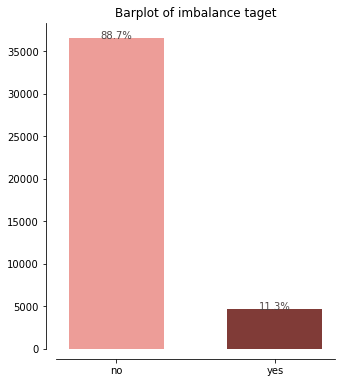
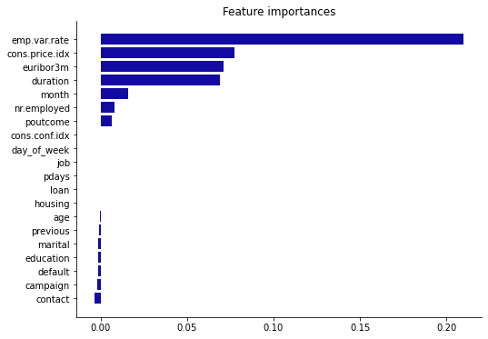

# Term Deposit Subscription Modelling


Contributer: Eriko Funasato

About the problem
---
The given dataset is about direct phonecall campaign of bank marketing. The problems we are trying to solve with this data set are:

* Classification goal of predicting whether the client would subscribe to term deposit.
* Interpret the inferential to get key important features that makes the campaign effective. 


About the Data
-----
As mentioned above, I am using a dataset about direct phone call bank marketing campaign. This is a dataset from UCI machine learning repository, which mainly consists of five components of data. 


### Attribute Information:


**bank client data:**

1. age (numeric)
2. job : type of job (categorical: 'admin.','blue-collar','entrepreneur','housemaid','management','retired','selfemployed','services','student','technician','unemployed','unknown')
3. marital : marital status (categorical: 'divorced','married','single','unknown'; note: 'divorced' means divorced or widowed)
4. education (categorical: 'basic.4y','basic.6y','basic.9y','high.school','illiterate','professional.course','university.degree','unknown')
5. default: has credit in default? (categorical: 'no','yes','unknown')
6. housing: has housing loan? (categorical: 'no','yes','unknown')
7. loan: has personal loan? (categorical: 'no','yes','unknown')

**related with the last contact of the current campaign:**

8. contact: contact communication type (categorical: 'cellular','telephone')
9. month: last contact month of year (categorical: 'jan', 'feb', 'mar', ..., 'nov', 'dec')
10. day_of_week: last contact day of the week (categorical: 'mon','tue','wed','thu','fri')
11. duration: last contact duration, in seconds (numeric). Important note: this attribute highly affects the output target (e.g., if duration=0 then y='no'). Yet, the duration is not known before a call is performed. Also, after the end of the call y is obviously known. Thus, this input should only be included for benchmark purposes and should be discarded if the intention is to have a realistic predictive model.

**other attributes:**

12. campaign: number of contacts performed during this campaign and for this client (numeric, includes last contact)
13. pdays: number of days that passed by after the client was last contacted from a previous campaign (numeric; 999 means client was not previously contacted)
14. previous: number of contacts performed before this campaign and for this client (numeric)
15. poutcome: outcome of the previous marketing campaign (categorical: 'failure','nonexistent','success')

**social and economic context attributes**

16. emp.var.rate: employment variation rate - quarterly indicator (numeric)
17. cons.price.idx: consumer price index - monthly indicator (numeric)
18. cons.conf.idx: consumer confidence index - monthly indicator (numeric)
19. euribor3m: euribor 3 month rate - daily indicator (numeric)
20. nr.employed: number of employees - quarterly indicator (numeric)

**Output variable (desired target):**
21 - y - has the client subscribed a term deposit? (binary: 'yes','no')


```python
# Imports
from   category_encoders          import *
import numpy as np
import pandas as pd
from   sklearn.compose            import *
from   sklearn.ensemble           import RandomForestClassifier, ExtraTreesClassifier, IsolationForest
from   sklearn.experimental       import enable_iterative_imputer
from   sklearn.impute             import *
from   sklearn.linear_model       import LogisticRegression, RidgeClassifier, SGDClassifier
from   sklearn.metrics            import balanced_accuracy_score, mean_absolute_error
from   sklearn.pipeline           import Pipeline
from   sklearn.preprocessing      import *
from   sklearn.tree               import DecisionTreeClassifier, ExtraTreeClassifier
from   sklearn.model_selection    import train_test_split,RandomizedSearchCV, GridSearchCV
from   sklearn.base               import BaseEstimator
from   sklearn.metrics            import *
from   sklearn.neighbors          import KNeighborsClassifier
from   sklearn.svm                import SVC
from   sklearn.ensemble       import VotingClassifier


import seaborn as sns
import matplotlib.pyplot as plt
# from pandas_profiling import ProfileReport
```


```python
# To make csv comma separated: $ tr ';' ',' < bank.csv > output.csv 
df = pd.read_csv('bank_comma.csv')
```


```python
df.head()
```


```python
df.info()
```

    <class 'pandas.core.frame.DataFrame'>
    RangeIndex: 41188 entries, 0 to 41187
    Data columns (total 21 columns):
     #   Column          Non-Null Count  Dtype  
    ---  ------          --------------  -----  
     0   age             41188 non-null  int64  
     1   job             41188 non-null  object 
     2   marital         41188 non-null  object 
     3   education       41188 non-null  object 
     4   default         41188 non-null  object 
     5   housing         41188 non-null  object 
     6   loan            41188 non-null  object 
     7   contact         41188 non-null  object 
     8   month           41188 non-null  object 
     9   day_of_week     41188 non-null  object 
     10  duration        41188 non-null  int64  
     11  campaign        41188 non-null  int64  
     12  pdays           41188 non-null  int64  
     13  previous        41188 non-null  int64  
     14  poutcome        41188 non-null  object 
     15  emp.var.rate    41188 non-null  float64
     16  cons.price.idx  41188 non-null  float64
     17  cons.conf.idx   41188 non-null  float64
     18  euribor3m       41188 non-null  float64
     19  nr.employed     41188 non-null  float64
     20  y               41188 non-null  object 
    dtypes: float64(5), int64(5), object(11)
    memory usage: 6.6+ MB
    


```python
df.describe()
```


<div>
<style scoped>
    .dataframe tbody tr th:only-of-type {
        vertical-align: middle;
    }

    .dataframe tbody tr th {
        vertical-align: top;
    }

    .dataframe thead th {
        text-align: right;
    }
</style>
<table border="1" class="dataframe">
  <thead>
    <tr style="text-align: right;">
      <th></th>
      <th>age</th>
      <th>duration</th>
      <th>campaign</th>
      <th>pdays</th>
      <th>previous</th>
      <th>emp.var.rate</th>
      <th>cons.price.idx</th>
      <th>cons.conf.idx</th>
      <th>euribor3m</th>
      <th>nr.employed</th>
    </tr>
  </thead>
  <tbody>
    <tr>
      <th>count</th>
      <td>41188.00000</td>
      <td>41188.000000</td>
      <td>41188.000000</td>
      <td>41188.000000</td>
      <td>41188.000000</td>
      <td>41188.000000</td>
      <td>41188.000000</td>
      <td>41188.000000</td>
      <td>41188.000000</td>
      <td>41188.000000</td>
    </tr>
    <tr>
      <th>mean</th>
      <td>40.02406</td>
      <td>258.285010</td>
      <td>2.567593</td>
      <td>962.475454</td>
      <td>0.172963</td>
      <td>0.081886</td>
      <td>93.575664</td>
      <td>-40.502600</td>
      <td>3.621291</td>
      <td>5167.035911</td>
    </tr>
    <tr>
      <th>std</th>
      <td>10.42125</td>
      <td>259.279249</td>
      <td>2.770014</td>
      <td>186.910907</td>
      <td>0.494901</td>
      <td>1.570960</td>
      <td>0.578840</td>
      <td>4.628198</td>
      <td>1.734447</td>
      <td>72.251528</td>
    </tr>
    <tr>
      <th>min</th>
      <td>17.00000</td>
      <td>0.000000</td>
      <td>1.000000</td>
      <td>0.000000</td>
      <td>0.000000</td>
      <td>-3.400000</td>
      <td>92.201000</td>
      <td>-50.800000</td>
      <td>0.634000</td>
      <td>4963.600000</td>
    </tr>
    <tr>
      <th>25%</th>
      <td>32.00000</td>
      <td>102.000000</td>
      <td>1.000000</td>
      <td>999.000000</td>
      <td>0.000000</td>
      <td>-1.800000</td>
      <td>93.075000</td>
      <td>-42.700000</td>
      <td>1.344000</td>
      <td>5099.100000</td>
    </tr>
    <tr>
      <th>50%</th>
      <td>38.00000</td>
      <td>180.000000</td>
      <td>2.000000</td>
      <td>999.000000</td>
      <td>0.000000</td>
      <td>1.100000</td>
      <td>93.749000</td>
      <td>-41.800000</td>
      <td>4.857000</td>
      <td>5191.000000</td>
    </tr>
    <tr>
      <th>75%</th>
      <td>47.00000</td>
      <td>319.000000</td>
      <td>3.000000</td>
      <td>999.000000</td>
      <td>0.000000</td>
      <td>1.400000</td>
      <td>93.994000</td>
      <td>-36.400000</td>
      <td>4.961000</td>
      <td>5228.100000</td>
    </tr>
    <tr>
      <th>max</th>
      <td>98.00000</td>
      <td>4918.000000</td>
      <td>56.000000</td>
      <td>999.000000</td>
      <td>7.000000</td>
      <td>1.400000</td>
      <td>94.767000</td>
      <td>-26.900000</td>
      <td>5.045000</td>
      <td>5228.100000</td>
    </tr>
  </tbody>
</table>
</div>


Fit scikit-learn model
----


```python
fig, ax = plt.subplots(figsize=(5,6))

ax.bar(y.unique(), y.value_counts(),width=0.6,color=['#ed9d98','#803b37'])
for p in ax.patches:
    ax.annotate('{:.1f}%'.format(100*p.get_height()/len(df)), (p.get_x()+p.get_width()/3, p.get_height()+9),color='#4f4646')
    
ax.set_title("Barplot of imbalance taget")
ax.spines['left'].set_position(('outward', 10))
ax.spines['bottom'].set_position(('outward', 10))
ax.spines['right'].set_visible(False)
ax.spines['top'].set_visible(False)
plt.savefig("imbalance.png")
plt.show()
```


    

    


Preprocessing 
---


```python
df.columns
```


    Index(['age', 'job', 'marital', 'education', 'default', 'housing', 'loan',
           'contact', 'month', 'day_of_week', 'duration', 'campaign', 'pdays',
           'previous', 'poutcome', 'emp.var.rate', 'cons.price.idx',
           'cons.conf.idx', 'euribor3m', 'nr.employed', 'y'],
          dtype='object')


```python
df.isnull().any()
```


    age               False
    job               False
    marital           False
    education         False
    default           False
    housing           False
    loan              False
    contact           False
    month             False
    day_of_week       False
    duration          False
    campaign          False
    pdays             False
    previous          False
    poutcome          False
    emp.var.rate      False
    cons.price.idx    False
    cons.conf.idx     False
    euribor3m         False
    nr.employed       False
    y                 False
    dtype: bool


```python
# replace the no previous call rows(noted 999) in pdays
df['pdays'].replace({999:0}, inplace=True)
```


```python
X = df.drop(columns=['y'])
y = df['y']
```


```python
# Split the data into train, validation, and test set
X_train, X_test, y_train, y_test = train_test_split(X,y)
X_train, X_val, y_train, y_val = train_test_split(X_train, y_train)
```


```python
y_train.replace({"no":0,"yes":1}, inplace=True)
y_val.replace({"no":0,"yes":1}, inplace=True)
y_test.replace({"no":0,"yes":1}, inplace=True)
```


```python
categorical_columns = (X.dtypes == object)

con_pipe = Pipeline([('imputer', SimpleImputer(strategy='median', add_indicator=True)),
                     ('scaler', StandardScaler())])

cat_pipe = Pipeline([('imputer', SimpleImputer(strategy='most_frequent',missing_values="unknown", add_indicator=True)),
                     ('ohe', OneHotEncoder())])

preprocessing = ColumnTransformer([('categorical', cat_pipe,  categorical_columns),
                                   ('continuous',  con_pipe, ~categorical_columns),
                                   ])
```

## 1. Baseline - Logistic Regression
---


```python
pipe1 = Pipeline([('preprocessing',preprocessing),
                 ('lr',LogisticRegression(class_weight="balanced"))]) 
pipe1.fit(X_train,y_train)
```

    C:\Users\eriko\anaconda3\lib\site-packages\sklearn\linear_model\_logistic.py:763: ConvergenceWarning: lbfgs failed to converge (status=1):
    STOP: TOTAL NO. of ITERATIONS REACHED LIMIT.
    
    Increase the number of iterations (max_iter) or scale the data as shown in:
        https://scikit-learn.org/stable/modules/preprocessing.html
    Please also refer to the documentation for alternative solver options:
        https://scikit-learn.org/stable/modules/linear_model.html#logistic-regression
      n_iter_i = _check_optimize_result(
    


    Pipeline(steps=[('preprocessing',
                     ColumnTransformer(transformers=[('categorical',
                                                      Pipeline(steps=[('imputer',
                                                                       SimpleImputer(add_indicator=True,
                                                                                     missing_values='unknown',
                                                                                     strategy='most_frequent')),
                                                                      ('ohe',
                                                                       OneHotEncoder())]),
                                                      age               False
    job                True
    marital            True
    education          True
    default            True
    housing            True
    loan               True
    contact            True
    month              True
    day_of_week        True
    duration          False
    campaign          False
    pd...
                                                                                     strategy='median')),
                                                                      ('scaler',
                                                                       StandardScaler())]),
                                                      age                True
    job               False
    marital           False
    education         False
    default           False
    housing           False
    loan              False
    contact           False
    month             False
    day_of_week       False
    duration           True
    campaign           True
    pdays              True
    previous           True
    poutcome          False
    emp.var.rate       True
    cons.price.idx     True
    cons.conf.idx      True
    euribor3m          True
    nr.employed        True
    dtype: bool)])),
                    ('lr', LogisticRegression(class_weight='balanced'))])


```python
pipe1.score(X_train,y_train)
```


    0.8626553867403315


```python
pipe1.score(X_val,y_val)
```


    0.8636540204583711


## 2. Random Grid Search -> RandomForest
---
Use RandomizedSearchCV to search for the hyperparameter and the best performing model 


```python
# Dummy estimator to tune hyperparameter 
class DummyEstimator(BaseEstimator):
    "Pass through class, methods are present but do nothing."
    def fit(self): pass
    def score(self): pass
```


```python
# Number of trees in random forest
n_estimators = [int(x) for x in np.linspace(start = 200, stop = 2000, num = 10)]
# Number of features to consider at every split
max_features = ['auto', 'sqrt']
# Maximum number of levels in tree
max_depth = [5,10,15,20,25,50,75,100]
# Minimum number of samples required to split a node
min_samples_split = [2, 5, 10]
max_samples_leaf = [10, 20, 30, 50]
# Method of selecting samples for training each tree
bootstrap = [True, False]

pipe_dummy = Pipeline([('preprocessing',preprocessing),
                        ('clf', DummyEstimator())])

search_space = [{'clf': [ExtraTreesClassifier(),RandomForestClassifier()], # Actual Estimator
                 'clf__max_depth': max_depth,
                 'clf__n_estimators':n_estimators,
                 'clf__bootstrap':bootstrap,
                 'clf__max_features': max_features,
                 'clf__max_leaf_nodes': max_samples_leaf,
                 'clf__criterion': ['gini', 'entropy']}]
    

clf_algos_rand = RandomizedSearchCV(estimator=pipe_dummy, 
                                    param_distributions=search_space, 
                                    n_iter=40,
                                    cv=7, 
                                    n_jobs=-1,
                                    scoring='f1_weighted',
                                    verbose=1)


best_model = clf_algos_rand.fit(X_train, y_train);
best_model.best_params_, best_model.best_score_

```

    Fitting 7 folds for each of 40 candidates, totalling 280 fits
    


    ({'clf__n_estimators': 400,
      'clf__max_leaf_nodes': 50,
      'clf__max_features': 'sqrt',
      'clf__max_depth': 50,
      'clf__criterion': 'gini',
      'clf__bootstrap': False,
      'clf': RandomForestClassifier(bootstrap=False, max_depth=50, max_features='sqrt',
                             max_leaf_nodes=50, n_estimators=400)},
     0.8874704280669582)


Train Random Forest model 
---


```python
pipe2 = Pipeline([('preprocessing',preprocessing),
                 ('rf', RandomForestClassifier(bootstrap=False, max_depth=50, max_features='sqrt',
                         max_leaf_nodes=50, n_estimators=400))])
pipe2.fit(X_train, y_train)
pipe2.score(X_val,y_val)
```


    0.9041823125728344


## 3. Ensemble


```python
knn_clf = KNeighborsClassifier()
dt_clf  = DecisionTreeClassifier()
svm_clf = SVC()

voting_clf = VotingClassifier(estimators = [('knn', knn_clf), 
                                            ('dt', dt_clf), 
                                            ('svc',svm_clf)],
                              voting = 'hard')
pipe3 = Pipeline([('preprocessing',preprocessing),
                 ('clf', voting_clf)])
pipe3.fit(X_train, y_train)
pipe3.score(X_val, y_val)
```


    0.9088437135828046


## 4. Evaluation Metric
----


```python
y_pred1 = pipe1.predict(X_val)
y_pred2 = pipe2.predict(X_val)
y_pred3 = pipe3.predict(X_val)
```


```python
# Confusion Matrix
print("Logistic Regression:\n",confusion_matrix(y_val,y_pred1))
print("Random Forest:\n",confusion_matrix(y_val,y_pred2))
print("Ensembled Model\n:",confusion_matrix(y_val,y_pred3))
```

    Logistic Regression:
     [[5912  935]
     [ 118  758]]
    Random Forest:
     [[6774   73]
     [ 667  209]]
    Ensembled Model
    : [[6631  216]
     [ 488  388]]
    


```python
# Pipeline score 
print("logistic Regression:",pipe1.score(X_test,y_test))
print("Random Forest:",pipe2.score(X_test,y_test))
print("Ensemble model:",pipe3.score(X_test,y_test))
```

    logistic Regression: 0.8584053607846945
    Random Forest: 0.9041468388851122
    Ensemble model: 0.908808390793435
    


```python
# F1_score
print("logistic Regression:",f1_score(y_val, y_pred1, average='weighted'))
print("Random Forest:",f1_score(y_val, y_pred2, average='weighted'))
print("Ensemble model:",f1_score(y_val, y_pred3, average='weighted'))
```

    logistic Regression: 0.8810092358165441
    Random Forest: 0.8815990408835677
    Ensemble model: 0.9013548639566907
    


```python
from sklearn.inspection import permutation_importance
r = permutation_importance(pipe1, X_val, y_val,
                           n_repeats=30,
                           random_state=0)
```


```python

index = r.importances_mean.argsort()

fig, ax = plt.subplots(figsize=(8,6))

ax.barh(X_train.columns[index],r.importances_mean[index],
        color="#130ba1", align="center")
ax.set_title("Feature importances")
# ax.spines['left'].set_position(('outward', 10))
# ax.spines['bottom'].set_position(('outward', 10))
ax.spines['right'].set_visible(False)
ax.spines['top'].set_visible(False)

# plt.savefig("feature_impotance.png")
plt.show()
```


    

    


From the Feature importance plots, all the models agree that the employment variation rate, comsumer price index, euribor 3 month rate are the most important features in the model. We can tell that all these three features are social and econmics variables. 

Test Set Evaluation
---


```python
pipe3.score(X_test, y_test)
```


    0.908808390793435


