# Assembled Notebook for Group 4


```python
import numpy as np
import pandas as pd
import statsmodels.api as sm
from statsmodels.graphics.tsaplots import plot_acf
from statsmodels.graphics.tsaplots import plot_pacf
from statsmodels.tsa.stattools import adfuller
from statsmodels.tools.eval_measures import rmse
import warnings
warnings.filterwarnings("ignore")

import warnings
from math import sqrt
import matplotlib.pyplot as plt
from tqdm import tqdm

from statsmodels.tsa.holtwinters import ExponentialSmoothing
from fbprophet import Prophet
from statsmodels.tsa.stattools import arma_order_select_ic
from statsmodels.tsa.arima_model import ARMA

from sklearn.metrics import mean_squared_error
from sklearn.metrics import mean_absolute_error
# from sklearn.metrics import mean_absolute_percentage_error

from pmdarima.arima import auto_arima

```


```python
zillow = pd.read_csv('zillow-carlifornia.csv', 
                     index_col='Date', 
                     parse_dates=True, 
                     squeeze=True)

testset = zillow[zillow['MedianSoldPrice_AllHomes.California'].isnull()]

trainset = zillow[~zillow['MedianSoldPrice_AllHomes.California'].isnull()]
```

# 1. Original dataset

## 1.1. Time series of house sold price


```python
fig = plt.figure(figsize=(10, 3))
ax = fig.add_subplot(111)
ax.plot(trainset['MedianSoldPrice_AllHomes.California'])
plt.show()
```


    
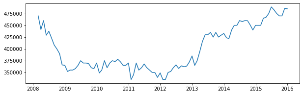
    


## 1.2. Time series of mortage rate


```python
fig = plt.figure(figsize=(10, 3))
ax = fig.add_subplot(111)
ax.plot(trainset['MedianMortageRate'])
plt.show()
```


    
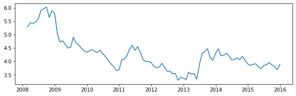
    


## 1.3. Time series of unemployment rate


```python
fig = plt.figure(figsize=(10, 3))
ax = fig.add_subplot(111)
ax.plot(trainset['UnemploymentRate'])
plt.show()
```


    
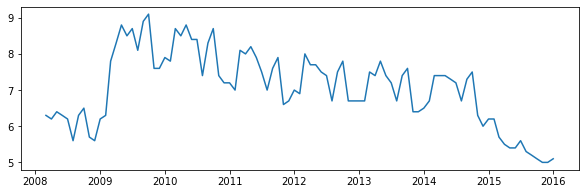
    


## 1.4. Time series summary


```python
hist_df_raw = pd.read_csv('zillow-carlifornia.csv')
hist_date = hist_df_raw['Date']
hist_df_raw = hist_df_raw.drop('Date', axis=1)
hist_df_raw.index = hist_date
hist_df = hist_df_raw.dropna()

# plot the basics
fig, ax = plt.subplots(1,3, figsize=(15,5))
ax[0].plot(hist_df['MedianSoldPrice_AllHomes.California'])
ax[0].set_title('Just Target Var')
ax[0].axis("off")

ax[1].set_title("All Three Vars")
ax[1].plot(hist_df['MedianSoldPrice_AllHomes.California'], label='price')
ax2 = ax[1].twinx()

ax2.plot(hist_df['MedianMortageRate'], color='green', label='mort')
ax2.plot(hist_df['UnemploymentRate'], color='orange', label='unemply')
ax2.axis("off")
ax[1].legend()
ax[1].axis("off")

ax[2].plot(hist_df['MedianMortageRate'], label='mortgage')
ax[2].plot(hist_df['UnemploymentRate'], label='unempl')
ax[2].legend()
ax[2].set_title('Other Two Vars')
ax[2].axis("off")


plt.show()
```


    
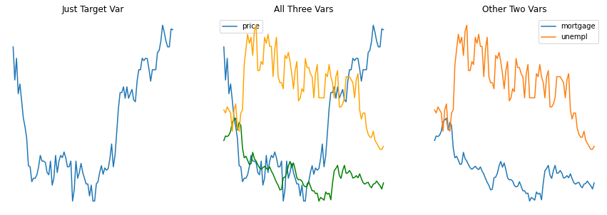
    


## 1.5. ADF test


```python
print(adfuller(hist_df['MedianSoldPrice_AllHomes.California'])[1])
print(adfuller(hist_df['MedianMortageRate'])[1])
print(adfuller(hist_df['UnemploymentRate'])[1])
# all non-stationary
```

    0.9533914166134371
    0.3691788792214963
    0.5427070415820341
    

# 2. Data with one differencing

## 2.1. Time series


```python
hist_d1 = hist_df.diff(1).dropna()

fig, ax = plt.subplots(1,3, figsize=(15,5))
ax[0].set_title('All 3 Vars, d=1')
ax[0].plot(hist_d1['MedianSoldPrice_AllHomes.California'])
ax[0].axis("off")

ax2 = ax[0].twinx()

ax2.plot(hist_d1['MedianMortageRate'])
ax2.plot(hist_d1['UnemploymentRate'])
ax2.axis("off")
ax[1].plot(hist_d1['MedianSoldPrice_AllHomes.California'])
ax[1].axis("off")
ax[1].set_title('Median Sold Price d=1')

ax[2].plot(hist_d1['MedianMortageRate'], label='mortgage')
ax[2].plot(hist_d1['UnemploymentRate'], label='unempl')
ax[2].legend()
ax[2].axis("off")
ax[2].set_title('Other Two')

plt.show()
```


    
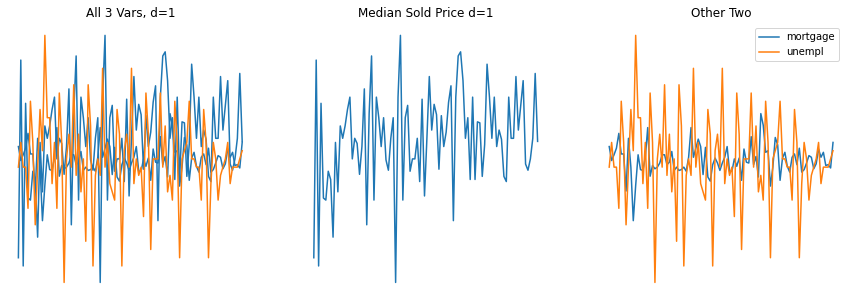
    


## 2.2. ACF and PACF plots


```python
# trend and seasonal differencing
def diff(data, interval=1):
    diff = list()
    for i in range(interval, len(data)):
        value = data[i] - data[i - interval]
        diff.append(value)
    return diff
```


```python
sp_d1 = diff(trainset['MedianSoldPrice_AllHomes.California'], 1)
sp_d2 = diff(sp_d1, 1)
```


```python
plot_acf(sp_d1,lags=92)
plt.title('ACF, d=1')
plt.show()
```


    
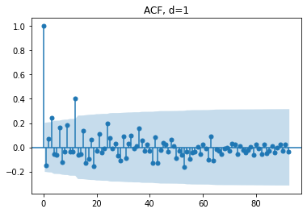
    


```python
plot_pacf(sp_d1,lags=25) 
plt.title('PACF, d=1')
plt.show()
```


    
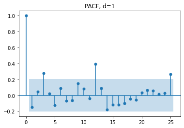
    


## 2.3. ADF test


```python
print(adfuller(hist_d1['MedianSoldPrice_AllHomes.California'])[1])
print(adfuller(hist_d1['MedianMortageRate'])[1])
print(adfuller(hist_d1['UnemploymentRate'])[1])  # not stationary (clear seasonality)
```

    0.027443482891832915
    1.1956156036316904e-13
    0.38916692143468756
    


```python
hist_d2 = hist_d1.diff().dropna()
print(adfuller(hist_d2['MedianSoldPrice_AllHomes.California'])[1])
print(adfuller(hist_d2['MedianMortageRate'])[1])
print(adfuller(hist_d2['UnemploymentRate'])[1])  
# All three stationary
```

    8.027575952217617e-11
    2.7565940776618233e-06
    2.838908286479344e-23
    

# Univariate - SARIMA


```python
zillow = pd.read_csv('zillow-carlifornia.csv', index_col='Date', parse_dates=True, squeeze=True)

testset = zillow[zillow['MedianSoldPrice_AllHomes.California'].isnull()]

trainset = zillow[~zillow['MedianSoldPrice_AllHomes.California'].isnull()]
# no missing values in trainset
```


```python
#auto sarimax search with m=12
from pmdarima.arima import auto_arima
model=auto_arima(trainset['MedianSoldPrice_AllHomes.California'],
                 start_p=0, 
                 start_q=0, 
                 max_p=5, 
                 max_q=5, 
                 max_d=1,
                 trace=True,
                 seasonal=True,
                 D=1,
                 m=12, 
                 max_P=5, 
                 max_Q=5, #add seasonality
                 error_action='ignore', 
                 suppress_warnings=True,
                 information_criterion='bic', 
                 n_jobs = -1,
                 return_valid_fits=True)
```

    Performing stepwise search to minimize bic
     ARIMA(0,1,0)(1,1,1)[12]             : BIC=inf, Time=1.37 sec
     ARIMA(0,1,0)(0,1,0)[12]             : BIC=1767.018, Time=0.03 sec
     ARIMA(1,1,0)(1,1,0)[12]             : BIC=1766.087, Time=0.06 sec
     ARIMA(0,1,1)(0,1,1)[12]             : BIC=1767.290, Time=0.08 sec
     ARIMA(1,1,0)(0,1,0)[12]             : BIC=1762.735, Time=0.02 sec
     ARIMA(1,1,0)(0,1,1)[12]             : BIC=1766.019, Time=0.08 sec
     ARIMA(1,1,0)(1,1,1)[12]             : BIC=inf, Time=0.25 sec
     ARIMA(2,1,0)(0,1,0)[12]             : BIC=1764.913, Time=0.03 sec
     ARIMA(1,1,1)(0,1,0)[12]             : BIC=1764.622, Time=0.07 sec
     ARIMA(0,1,1)(0,1,0)[12]             : BIC=1764.195, Time=0.02 sec
     ARIMA(2,1,1)(0,1,0)[12]             : BIC=1764.993, Time=0.08 sec
     ARIMA(1,1,0)(0,1,0)[12] intercept   : BIC=1765.401, Time=0.04 sec
    
    Best model:  ARIMA(1,1,0)(0,1,0)[12]          
    Total fit time: 2.226 seconds
    

# RMSE in validation set (2015-01-31)


```python
train = trainset[trainset.index < '2015-01-31']
valid = trainset[trainset.index >= '2015-01-31']
```


```python
from statsmodels.tsa.statespace.sarimax import SARIMAX

model= SARIMAX(train['MedianSoldPrice_AllHomes.California'], order=(1, 1, 0), seasonal_order=(0, 1, 0, 12), enforce_invertibility=False, enforce_stationarity=False)

```


```python
results= model.fit()
forecast= results.forecast(steps=len(valid))
forecast
```


    2015-01-31    439433.934347
    2015-02-28    438211.058956
    2015-03-31    456152.704687
    2015-04-30    466164.992375
    2015-05-31    466162.404950
    2015-06-30    476162.949786
    2015-07-31    474162.835059
    2015-08-31    476162.859217
    2015-09-30    475912.854130
    2015-10-31    466662.855201
    2015-11-30    456162.854976
    2015-12-31    466162.855023
    Freq: M, Name: predicted_mean, dtype: float64


```python
plt.figure(figsize=(30, 10))

plt.plot(valid['MedianSoldPrice_AllHomes.California'], label='actual')
plt.plot(forecast, label='SARIMA forecast')
plt.legend(loc='upper left', fontsize=20)
plt.title('Forecast vs Actual', fontsize = 25, y = 0.9)
plt.show()
```


    
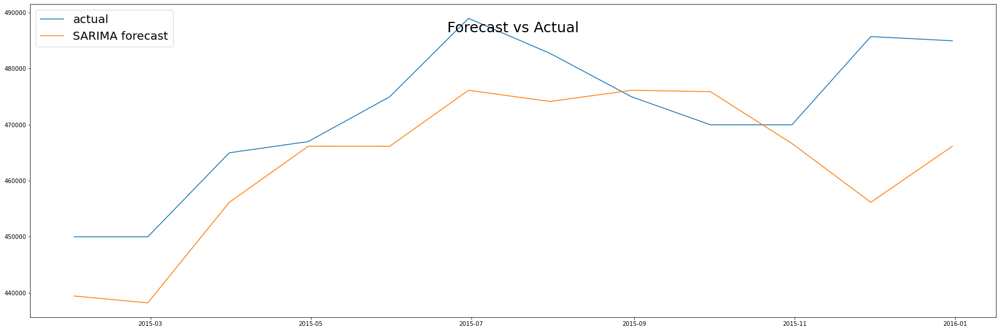
    


```python
rmse(valid['MedianSoldPrice_AllHomes.California'].values, forecast.values)
```


    12661.99331031762


# SARIMAX


```python
zillow = pd.read_csv('zillow-carlifornia.csv', index_col='Date', parse_dates=True, squeeze=True)

testset = zillow[zillow['MedianSoldPrice_AllHomes.California'].isnull()]

trainset = zillow[~zillow['MedianSoldPrice_AllHomes.California'].isnull()]
# no missing values in trainset
train = trainset[trainset.index < '2015-01-31']
valid = trainset[trainset.index >= '2015-01-31']
```

## Multivariate time series with mortage and unemployment as exogenous variables


```python
from sklearn.preprocessing import MinMaxScaler
sc = MinMaxScaler(feature_range=(0, 1))

train_sc = sc.fit_transform(train) #np.array with shape(n,3)
valid_sc = sc.transform(valid) #np.array with shape(n,3)
```


```python
#auto sarimax search with m=12
from pmdarima.arima import auto_arima
model=auto_arima(train_sc[:,0], # MedianSoldPrice_AllHomes.California as endogenous
                 exogenous= train_sc[:,1:], # MedianMortageRate and UnemploymentRate as exogenous variables
                 start_p=0, 
                 start_q=0, 
                 max_p=5, 
                 max_q=5, 
                 max_d=2,
                 trace=True,
                 seasonal=True,
                 D=1,
                 m=12, 
                 max_P=5, 
                 max_Q=5, #add seasonality
                 error_action='ignore', 
                 suppress_warnings=True,
                 information_criterion='bic', 
                 n_jobs = -1,
                 return_valid_fits=True)
```

Original Output

    Fit ARIMA: order=(0, 1, 0) seasonal_order=(1, 1, 1, 12); AIC=-140.822, BIC=-127.331, Fit time=0.332 seconds
    Fit ARIMA: order=(0, 1, 0) seasonal_order=(0, 1, 0, 12); AIC=-144.484, BIC=-135.490, Fit time=0.048 seconds
    Fit ARIMA: order=(1, 1, 0) seasonal_order=(1, 1, 0, 12); AIC=-148.827, BIC=-135.336, Fit time=0.228 seconds
    Fit ARIMA: order=(0, 1, 1) seasonal_order=(0, 1, 1, 12); AIC=-149.686, BIC=-136.195, Fit time=0.436 seconds
    Fit ARIMA: order=(0, 1, 1) seasonal_order=(1, 1, 1, 12); AIC=-150.327, BIC=-134.587, Fit time=0.467 seconds
    Fit ARIMA: order=(0, 1, 1) seasonal_order=(0, 1, 0, 12); AIC=-145.555, BIC=-134.313, Fit time=0.100 seconds
    Fit ARIMA: order=(0, 1, 1) seasonal_order=(0, 1, 2, 12); AIC=-151.255, BIC=-135.516, Fit time=0.719 seconds
    Fit ARIMA: order=(0, 1, 1) seasonal_order=(1, 1, 2, 12); AIC=-148.969, BIC=-130.981, Fit time=0.865 seconds
    Fit ARIMA: order=(1, 1, 1) seasonal_order=(0, 1, 1, 12); AIC=-154.120, BIC=-138.380, Fit time=0.411 seconds
    Fit ARIMA: order=(1, 1, 0) seasonal_order=(0, 1, 1, 12); AIC=-154.438, BIC=-140.947, Fit time=0.381 seconds
    Fit ARIMA: order=(2, 1, 1) seasonal_order=(0, 1, 1, 12); AIC=-160.407, BIC=-142.419, Fit time=0.433 seconds
    Fit ARIMA: order=(2, 1, 1) seasonal_order=(1, 1, 1, 12); AIC=-154.636, BIC=-134.399, Fit time=0.521 seconds
    Fit ARIMA: order=(2, 1, 1) seasonal_order=(0, 1, 0, 12); AIC=-156.041, BIC=-140.301, Fit time=0.253 seconds
    Fit ARIMA: order=(2, 1, 1) seasonal_order=(0, 1, 2, 12); AIC=-160.923, BIC=-140.686, Fit time=0.749 seconds
    Fit ARIMA: order=(2, 1, 1) seasonal_order=(1, 1, 2, 12); AIC=-157.942, BIC=-135.457, Fit time=0.859 seconds
    Fit ARIMA: order=(3, 1, 1) seasonal_order=(0, 1, 1, 12); AIC=-160.453, BIC=-140.217, Fit time=0.512 seconds
    Fit ARIMA: order=(2, 1, 0) seasonal_order=(0, 1, 1, 12); AIC=-156.159, BIC=-140.420, Fit time=0.446 seconds
    Fit ARIMA: order=(2, 1, 2) seasonal_order=(0, 1, 1, 12); AIC=-160.726, BIC=-140.490, Fit time=0.475 seconds
    Fit ARIMA: order=(3, 1, 2) seasonal_order=(0, 1, 1, 12); AIC=-159.215, BIC=-136.730, Fit time=0.604 seconds
    Total fit time: 8.847 seconds
    
Fit ARIMA: order=(2, 1, 1) seasonal_order=(0, 1, 1, 12); AIC=-160.407, BIC=-142.419, Fit time=0.445 seconds


```python
from statsmodels.tsa.statespace.sarimax import SARIMAX

model= SARIMAX(endog=train_sc[:,0], exog= train_sc[:,1:], order=(2, 1, 1)\
               , seasonal_order=(0, 1, 1, 12), enforce_invertibility=False, enforce_stationarity=False)
```


```python
results= model.fit()
forecast= results.forecast(steps=len(valid_sc), exog=valid_sc[:,1:])
forecast
```


    array([0.71492088, 0.66675018, 0.7817485 , 0.80327651, 0.85240447,
           0.92405719, 0.9282005 , 0.86716193, 0.8476492 , 0.86553731,
           0.84782207, 0.89255266])


```python
forecast_sc = np.concatenate((forecast.reshape(-1,1), valid_sc), axis=1)[:, [0,2,3]] 
# forecast price, mortage, unemployement

```


```python
testPredict = sc.inverse_transform(forecast_sc)
pred = pd.DataFrame(testPredict)
pred = pred.set_index(valid.index)

pred_df = pred.rename(columns={0: 'MedianSoldPrice_AllHomes.California',\
                               1: 'MedianMortageRate', 2: 'UnemploymentRate'})
pred_df
```


<div>
<style scoped>
    .dataframe tbody tr th:only-of-type {
        vertical-align: middle;
    }

    .dataframe tbody tr th {
        vertical-align: top;
    }

    .dataframe thead th {
        text-align: right;
    }
</style>
<table border="1" class="dataframe">
  <thead>
    <tr style="text-align: right;">
      <th></th>
      <th>MedianSoldPrice_AllHomes.California</th>
      <th>MedianMortageRate</th>
      <th>UnemploymentRate</th>
    </tr>
    <tr>
      <th>Date</th>
      <th></th>
      <th></th>
      <th></th>
    </tr>
  </thead>
  <tbody>
    <tr>
      <th>2015-01-31</th>
      <td>431514.319369</td>
      <td>3.85</td>
      <td>6.2</td>
    </tr>
    <tr>
      <th>2015-02-28</th>
      <td>425011.273626</td>
      <td>3.89</td>
      <td>5.7</td>
    </tr>
    <tr>
      <th>2015-03-31</th>
      <td>440536.047711</td>
      <td>3.91</td>
      <td>5.5</td>
    </tr>
    <tr>
      <th>2015-04-30</th>
      <td>443442.329402</td>
      <td>3.79</td>
      <td>5.4</td>
    </tr>
    <tr>
      <th>2015-05-31</th>
      <td>450074.603079</td>
      <td>3.73</td>
      <td>5.4</td>
    </tr>
    <tr>
      <th>2015-06-30</th>
      <td>459747.720744</td>
      <td>3.85</td>
      <td>5.6</td>
    </tr>
    <tr>
      <th>2015-07-31</th>
      <td>460307.067090</td>
      <td>3.87</td>
      <td>5.3</td>
    </tr>
    <tr>
      <th>2015-08-31</th>
      <td>452066.860114</td>
      <td>3.95</td>
      <td>5.2</td>
    </tr>
    <tr>
      <th>2015-09-30</th>
      <td>449432.642409</td>
      <td>3.87</td>
      <td>5.1</td>
    </tr>
    <tr>
      <th>2015-10-31</th>
      <td>451847.536784</td>
      <td>3.80</td>
      <td>5.0</td>
    </tr>
    <tr>
      <th>2015-11-30</th>
      <td>449455.980059</td>
      <td>3.69</td>
      <td>5.0</td>
    </tr>
    <tr>
      <th>2015-12-31</th>
      <td>455494.608768</td>
      <td>3.89</td>
      <td>5.1</td>
    </tr>
  </tbody>
</table>
</div>


```python
plt.figure(figsize=(30, 10))

plt.plot(valid['MedianSoldPrice_AllHomes.California'], label='actual')
plt.plot(pred_df['MedianSoldPrice_AllHomes.California'], label='SARIMAX forecast')
plt.legend(loc='upper left', fontsize=20)
plt.title('Forecast vs Actual', fontsize = 25, y = 0.9)
plt.show()
```


    
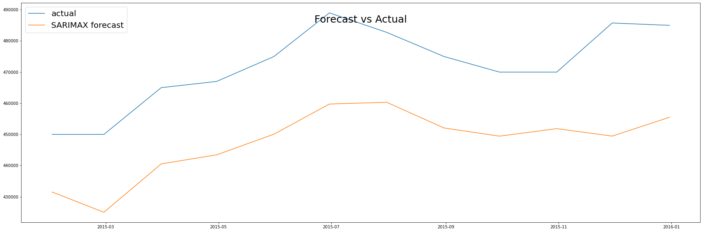
    


```python
rmse(valid['MedianSoldPrice_AllHomes.California'], pred_df['MedianSoldPrice_AllHomes.California'])

```


    25110.66033604499


Original results: 25004, some issues when compiling notebooks together

## Multivariate time series with mortage as exogenous variable


```python
#auto sarimax search with m=12
from pmdarima.arima import auto_arima
model=auto_arima(train_sc[:,0], # MedianSoldPrice_AllHomes.California as endogenous
                 exogenous= train_sc[:,1:2], # MedianMortageRate and UnemploymentRate as exogenous variables
                 start_p=0, 
                 start_q=0, 
                 max_p=5, 
                 max_q=5, 
                 max_d=2,
                 trace=True,
                 seasonal=True,
                 D=1,
                 m=12, 
                 max_P=5, 
                 max_Q=5, #add seasonality
                 error_action='ignore', 
                 suppress_warnings=True,
                 information_criterion='bic', 
                 n_jobs = -1,
                 return_valid_fits=True)
```

Original results:

    Fit ARIMA: order=(0, 1, 0) seasonal_order=(1, 1, 1, 12); AIC=-142.790, BIC=-131.548, Fit time=0.188 seconds
    Fit ARIMA: order=(0, 1, 0) seasonal_order=(0, 1, 0, 12); AIC=-146.336, BIC=-139.590, Fit time=0.018 seconds
    Fit ARIMA: order=(1, 1, 0) seasonal_order=(1, 1, 0, 12); AIC=-150.817, BIC=-139.575, Fit time=0.290 seconds
    Fit ARIMA: order=(0, 1, 1) seasonal_order=(0, 1, 1, 12); AIC=-151.654, BIC=-140.412, Fit time=0.308 seconds
    Fit ARIMA: order=(0, 1, 1) seasonal_order=(1, 1, 1, 12); AIC=-152.385, BIC=-138.894, Fit time=0.458 seconds
    Fit ARIMA: order=(0, 1, 1) seasonal_order=(0, 1, 0, 12); AIC=-147.338, BIC=-138.344, Fit time=0.097 seconds
    Fit ARIMA: order=(0, 1, 1) seasonal_order=(0, 1, 2, 12); AIC=-153.048, BIC=-139.557, Fit time=0.663 seconds
    Fit ARIMA: order=(0, 1, 1) seasonal_order=(1, 1, 2, 12); AIC=-150.701, BIC=-134.962, Fit time=0.922 seconds
    Fit ARIMA: order=(1, 1, 1) seasonal_order=(0, 1, 1, 12); AIC=-156.069, BIC=-142.578, Fit time=0.314 seconds
    Fit ARIMA: order=(1, 1, 0) seasonal_order=(0, 1, 1, 12); AIC=-156.384, BIC=-145.142, Fit time=0.417 seconds
    Fit ARIMA: order=(2, 1, 1) seasonal_order=(0, 1, 1, 12); AIC=-162.242, BIC=-146.502, Fit time=0.445 seconds
    Fit ARIMA: order=(2, 1, 1) seasonal_order=(1, 1, 1, 12); AIC=-156.969, BIC=-138.981, Fit time=0.527 seconds
    Fit ARIMA: order=(2, 1, 1) seasonal_order=(0, 1, 0, 12); AIC=-157.386, BIC=-143.895, Fit time=0.193 seconds
    Fit ARIMA: order=(2, 1, 1) seasonal_order=(0, 1, 2, 12); AIC=-163.012, BIC=-145.024, Fit time=0.737 seconds
    Fit ARIMA: order=(2, 1, 1) seasonal_order=(1, 1, 2, 12); AIC=-160.092, BIC=-139.855, Fit time=1.244 seconds
    Fit ARIMA: order=(3, 1, 1) seasonal_order=(0, 1, 1, 12); AIC=-161.968, BIC=-143.980, Fit time=0.487 seconds
    Fit ARIMA: order=(2, 1, 0) seasonal_order=(0, 1, 1, 12); AIC=-158.150, BIC=-144.659, Fit time=0.421 seconds
    Fit ARIMA: order=(2, 1, 2) seasonal_order=(0, 1, 1, 12); AIC=-162.205, BIC=-144.217, Fit time=0.454 seconds
    Fit ARIMA: order=(3, 1, 2) seasonal_order=(0, 1, 1, 12); AIC=-160.548, BIC=-140.312, Fit time=0.533 seconds
    Total fit time: 8.723 seconds

Fit ARIMA: order=(2, 1, 1) seasonal_order=(0, 1, 1, 12); AIC=-162.242, BIC=-146.502, Fit time=0.445 seconds


```python
from statsmodels.tsa.statespace.sarimax import SARIMAX

model= SARIMAX(endog=train_sc[:,0], exog= train_sc[:,1:2], order=(2, 1, 1),\
               seasonal_order=(0, 1, 1, 12), enforce_invertibility=False, enforce_stationarity=False)

```


```python
results= model.fit()
forecast= results.forecast(steps=len(valid_sc), exog=valid_sc[:,1:2])
forecast
```


    array([0.71045918, 0.7426349 , 0.86416815, 0.90089179, 0.93360813,
           0.98560436, 0.97008014, 0.95147606, 0.94954207, 0.90479613,
           0.88172785, 0.93003727])


```python
forecast_sc = np.concatenate((forecast.reshape(-1,1), valid_sc), axis=1)[:, [0,2,3]] 
# forecast price, mortage, unemployement
```


```python
testPredict = sc.inverse_transform(forecast_sc)
pred = pd.DataFrame(testPredict)
pred = pred.set_index(valid.index)

pred_df = pred.rename(columns={0: 'MedianSoldPrice_AllHomes.California',\
                               1: 'MedianMortageRate', 2: 'UnemploymentRate'})
pred_df
```


<div>
<style scoped>
    .dataframe tbody tr th:only-of-type {
        vertical-align: middle;
    }

    .dataframe tbody tr th {
        vertical-align: top;
    }

    .dataframe thead th {
        text-align: right;
    }
</style>
<table border="1" class="dataframe">
  <thead>
    <tr style="text-align: right;">
      <th></th>
      <th>MedianSoldPrice_AllHomes.California</th>
      <th>MedianMortageRate</th>
      <th>UnemploymentRate</th>
    </tr>
    <tr>
      <th>Date</th>
      <th></th>
      <th></th>
      <th></th>
    </tr>
  </thead>
  <tbody>
    <tr>
      <th>2015-01-31</th>
      <td>430911.989765</td>
      <td>3.85</td>
      <td>6.2</td>
    </tr>
    <tr>
      <th>2015-02-28</th>
      <td>435255.711122</td>
      <td>3.89</td>
      <td>5.7</td>
    </tr>
    <tr>
      <th>2015-03-31</th>
      <td>451662.700029</td>
      <td>3.91</td>
      <td>5.5</td>
    </tr>
    <tr>
      <th>2015-04-30</th>
      <td>456620.391314</td>
      <td>3.79</td>
      <td>5.4</td>
    </tr>
    <tr>
      <th>2015-05-31</th>
      <td>461037.097133</td>
      <td>3.73</td>
      <td>5.4</td>
    </tr>
    <tr>
      <th>2015-06-30</th>
      <td>468056.588611</td>
      <td>3.85</td>
      <td>5.6</td>
    </tr>
    <tr>
      <th>2015-07-31</th>
      <td>465960.819124</td>
      <td>3.87</td>
      <td>5.3</td>
    </tr>
    <tr>
      <th>2015-08-31</th>
      <td>463449.267717</td>
      <td>3.95</td>
      <td>5.2</td>
    </tr>
    <tr>
      <th>2015-09-30</th>
      <td>463188.179929</td>
      <td>3.87</td>
      <td>5.1</td>
    </tr>
    <tr>
      <th>2015-10-31</th>
      <td>457147.477574</td>
      <td>3.80</td>
      <td>5.0</td>
    </tr>
    <tr>
      <th>2015-11-30</th>
      <td>454033.260118</td>
      <td>3.69</td>
      <td>5.0</td>
    </tr>
    <tr>
      <th>2015-12-31</th>
      <td>460555.031280</td>
      <td>3.89</td>
      <td>5.1</td>
    </tr>
  </tbody>
</table>
</div>


```python
plt.figure(figsize=(30, 10))

plt.plot(valid['MedianSoldPrice_AllHomes.California'], label='actual')
plt.plot(pred_df['MedianSoldPrice_AllHomes.California'], label='SARIMAX forecast')
plt.legend(loc='upper left', fontsize=20)
plt.title('Forecast vs Actual', fontsize = 25, y = 0.9)
plt.show()
```


    
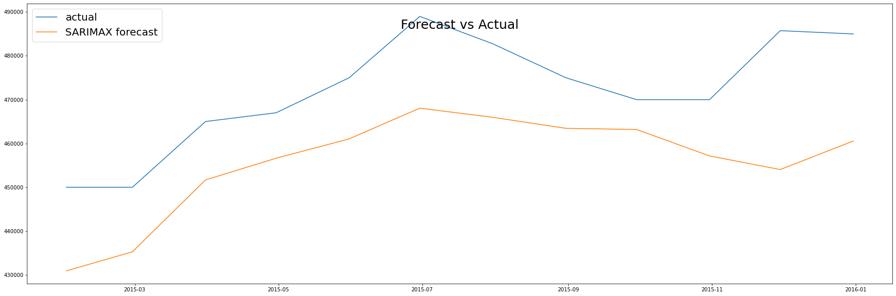
    


```python
rmse(valid['MedianSoldPrice_AllHomes.California'], pred_df['MedianSoldPrice_AllHomes.California'])

```


    17633.650345066555


Original results were 17619, as seen in our report. Some slight differences when compiling single notebook

## Multivariate time series with unemployment as exogenous variable


```python
#auto sarimax search with m=12
from pmdarima.arima import auto_arima
model=auto_arima(train_sc[:,0], # MedianSoldPrice_AllHomes.California as endogenous
                 exogenous= train_sc[:,2:], # MedianMortageRate and UnemploymentRate as exogenous variables
                 start_p=0, 
                 start_q=0, 
                 max_p=5, 
                 max_q=5, 
                 max_d=2,
                 trace=True,
                 seasonal=True,
                 D=1,
                 m=12, 
                 max_P=5, 
                 max_Q=5, #add seasonality
                 error_action='ignore', 
                 suppress_warnings=True,
                 information_criterion='bic', 
                 n_jobs = -1,
                 return_valid_fits=True)
```

Original Results

    Fit ARIMA: order=(0, 1, 0) seasonal_order=(1, 1, 1, 12); AIC=-146.082, BIC=-134.840, Fit time=0.611 seconds
    Fit ARIMA: order=(0, 1, 0) seasonal_order=(0, 1, 0, 12); AIC=-143.429, BIC=-136.683, Fit time=0.037 seconds
    Fit ARIMA: order=(1, 1, 0) seasonal_order=(1, 1, 0, 12); AIC=-146.284, BIC=-135.042, Fit time=0.205 seconds
    Fit ARIMA: order=(0, 1, 1) seasonal_order=(0, 1, 1, 12); AIC=-147.530, BIC=-136.288, Fit time=0.290 seconds
    Fit ARIMA: order=(0, 1, 0) seasonal_order=(1, 1, 0, 12); AIC=-142.306, BIC=-133.312, Fit time=0.150 seconds
    Fit ARIMA: order=(0, 1, 0) seasonal_order=(0, 1, 1, 12); AIC=-143.350, BIC=-134.356, Fit time=0.362 seconds
    Fit ARIMA: order=(1, 1, 0) seasonal_order=(0, 1, 0, 12); AIC=-146.097, BIC=-137.103, Fit time=0.065 seconds
    Fit ARIMA: order=(1, 1, 1) seasonal_order=(0, 1, 0, 12); AIC=-144.524, BIC=-133.282, Fit time=0.151 seconds
    Fit ARIMA: order=(2, 1, 1) seasonal_order=(0, 1, 0, 12); AIC=-150.550, BIC=-137.059, Fit time=0.249 seconds
    Fit ARIMA: order=(1, 1, 0) seasonal_order=(0, 1, 1, 12); AIC=-151.025, BIC=-139.782, Fit time=0.459 seconds
    Fit ARIMA: order=(1, 1, 0) seasonal_order=(1, 1, 2, 12); AIC=-152.096, BIC=-136.357, Fit time=0.729 seconds
    Fit ARIMA: order=(2, 1, 0) seasonal_order=(0, 1, 1, 12); AIC=-150.213, BIC=-136.722, Fit time=0.266 seconds
    Fit ARIMA: order=(1, 1, 1) seasonal_order=(0, 1, 1, 12); AIC=-149.711, BIC=-136.220, Fit time=0.321 seconds
    Fit ARIMA: order=(2, 1, 1) seasonal_order=(0, 1, 1, 12); AIC=-153.682, BIC=-137.942, Fit time=0.440 seconds
    Fit ARIMA: order=(1, 1, 0) seasonal_order=(1, 1, 1, 12); AIC=-151.673, BIC=-138.182, Fit time=0.447 seconds
    Fit ARIMA: order=(1, 1, 0) seasonal_order=(0, 1, 2, 12); AIC=-153.435, BIC=-139.944, Fit time=0.618 seconds
    Fit ARIMA: order=(1, 1, 0) seasonal_order=(1, 1, 3, 12); AIC=-150.104, BIC=-132.116, Fit time=1.542 seconds
    Fit ARIMA: order=(0, 1, 0) seasonal_order=(0, 1, 2, 12); AIC=-147.943, BIC=-136.701, Fit time=0.693 seconds
    Fit ARIMA: order=(2, 1, 0) seasonal_order=(0, 1, 2, 12); AIC=-152.769, BIC=-137.029, Fit time=0.521 seconds
    Fit ARIMA: order=(1, 1, 1) seasonal_order=(0, 1, 2, 12); AIC=-152.161, BIC=-136.422, Fit time=0.741 seconds
    Fit ARIMA: order=(2, 1, 1) seasonal_order=(0, 1, 2, 12); AIC=-158.260, BIC=-140.272, Fit time=1.067 seconds
    Fit ARIMA: order=(2, 1, 1) seasonal_order=(1, 1, 2, 12); AIC=-153.258, BIC=-133.022, Fit time=0.930 seconds
    Fit ARIMA: order=(2, 1, 1) seasonal_order=(0, 1, 3, 12); AIC=-156.195, BIC=-135.958, Fit time=1.660 seconds
    Fit ARIMA: order=(2, 1, 1) seasonal_order=(1, 1, 3, 12); AIC=-151.793, BIC=-129.308, Fit time=1.850 seconds
    Fit ARIMA: order=(3, 1, 1) seasonal_order=(0, 1, 2, 12); AIC=-159.197, BIC=-138.961, Fit time=0.997 seconds
    Fit ARIMA: order=(2, 1, 2) seasonal_order=(0, 1, 2, 12); AIC=-162.588, BIC=-142.352, Fit time=0.864 seconds
    Fit ARIMA: order=(3, 1, 3) seasonal_order=(0, 1, 2, 12); AIC=-157.785, BIC=-133.052, Fit time=1.444 seconds
    Fit ARIMA: order=(2, 1, 2) seasonal_order=(1, 1, 2, 12); AIC=-157.463, BIC=-134.978, Fit time=0.992 seconds
    Fit ARIMA: order=(2, 1, 2) seasonal_order=(0, 1, 1, 12); AIC=-160.281, BIC=-142.293, Fit time=0.508 seconds
    Fit ARIMA: order=(2, 1, 2) seasonal_order=(0, 1, 3, 12); AIC=-159.774, BIC=-137.289, Fit time=1.781 seconds
    Fit ARIMA: order=(2, 1, 2) seasonal_order=(1, 1, 3, 12); AIC=-157.624, BIC=-132.891, Fit time=2.038 seconds
    Fit ARIMA: order=(1, 1, 2) seasonal_order=(0, 1, 2, 12); AIC=-164.271, BIC=-146.283, Fit time=0.859 seconds
    Fit ARIMA: order=(1, 1, 3) seasonal_order=(0, 1, 2, 12); AIC=-158.338, BIC=-138.101, Fit time=1.341 seconds
    Fit ARIMA: order=(0, 1, 1) seasonal_order=(0, 1, 2, 12); AIC=-150.977, BIC=-137.486, Fit time=0.787 seconds
    Fit ARIMA: order=(2, 1, 3) seasonal_order=(0, 1, 2, 12); AIC=-160.278, BIC=-137.793, Fit time=1.484 seconds
    Fit ARIMA: order=(1, 1, 2) seasonal_order=(1, 1, 2, 12); AIC=-159.599, BIC=-139.362, Fit time=1.079 seconds
    Fit ARIMA: order=(1, 1, 2) seasonal_order=(0, 1, 1, 12); AIC=-161.426, BIC=-145.687, Fit time=0.446 seconds
    Fit ARIMA: order=(1, 1, 2) seasonal_order=(0, 1, 3, 12); AIC=-162.539, BIC=-142.303, Fit time=1.636 seconds
    Fit ARIMA: order=(1, 1, 2) seasonal_order=(1, 1, 3, 12); AIC=-161.066, BIC=-138.581, Fit time=2.172 seconds
    Fit ARIMA: order=(0, 1, 2) seasonal_order=(0, 1, 2, 12); AIC=-155.798, BIC=-140.058, Fit time=0.811 seconds
    Total fit time: 33.654 seconds
    
Fit ARIMA: order=(2, 1, 2) seasonal_order=(0, 1, 2, 12); AIC=-162.588, BIC=-142.352, Fit time=0.864 seconds


```python
from statsmodels.tsa.statespace.sarimax import SARIMAX

model= SARIMAX(endog=train_sc[:,0], exog= train_sc[:, 2:], order=(2, 1, 2),\
               seasonal_order=(0, 1, 2, 12), enforce_invertibility=False, enforce_stationarity=False)

```


```python
results= model.fit()
forecast= results.forecast(steps=len(valid_sc), exog=valid_sc[:, 2:])
forecast
```


    array([0.71408361, 0.64044266, 0.75070195, 0.73598985, 0.78901229,
           0.84889601, 0.83679173, 0.77833402, 0.74617962, 0.77239885,
           0.75629809, 0.81899219])


```python
forecast_sc = np.concatenate((forecast.reshape(-1,1), valid_sc), axis=1)[:, [0,2,3]]
# forecast price, mortage, unemployement
```


```python
testPredict = sc.inverse_transform(forecast_sc)
pred = pd.DataFrame(testPredict)
pred = pred.set_index(valid.index)

pred_df = pred.rename(columns={0: 'MedianSoldPrice_AllHomes.California',\
                               1: 'MedianMortageRate', 2: 'UnemploymentRate'})
pred_df
```


<div>
<style scoped>
    .dataframe tbody tr th:only-of-type {
        vertical-align: middle;
    }

    .dataframe tbody tr th {
        vertical-align: top;
    }

    .dataframe thead th {
        text-align: right;
    }
</style>
<table border="1" class="dataframe">
  <thead>
    <tr style="text-align: right;">
      <th></th>
      <th>MedianSoldPrice_AllHomes.California</th>
      <th>MedianMortageRate</th>
      <th>UnemploymentRate</th>
    </tr>
    <tr>
      <th>Date</th>
      <th></th>
      <th></th>
      <th></th>
    </tr>
  </thead>
  <tbody>
    <tr>
      <th>2015-01-31</th>
      <td>431401.287067</td>
      <td>3.85</td>
      <td>6.2</td>
    </tr>
    <tr>
      <th>2015-02-28</th>
      <td>421459.759442</td>
      <td>3.89</td>
      <td>5.7</td>
    </tr>
    <tr>
      <th>2015-03-31</th>
      <td>436344.762992</td>
      <td>3.91</td>
      <td>5.5</td>
    </tr>
    <tr>
      <th>2015-04-30</th>
      <td>434358.629124</td>
      <td>3.79</td>
      <td>5.4</td>
    </tr>
    <tr>
      <th>2015-05-31</th>
      <td>441516.658934</td>
      <td>3.73</td>
      <td>5.4</td>
    </tr>
    <tr>
      <th>2015-06-30</th>
      <td>449600.961949</td>
      <td>3.85</td>
      <td>5.6</td>
    </tr>
    <tr>
      <th>2015-07-31</th>
      <td>447966.883746</td>
      <td>3.87</td>
      <td>5.3</td>
    </tr>
    <tr>
      <th>2015-08-31</th>
      <td>440075.092770</td>
      <td>3.95</td>
      <td>5.2</td>
    </tr>
    <tr>
      <th>2015-09-30</th>
      <td>435734.248853</td>
      <td>3.87</td>
      <td>5.1</td>
    </tr>
    <tr>
      <th>2015-10-31</th>
      <td>439273.845206</td>
      <td>3.80</td>
      <td>5.0</td>
    </tr>
    <tr>
      <th>2015-11-30</th>
      <td>437100.241898</td>
      <td>3.69</td>
      <td>5.0</td>
    </tr>
    <tr>
      <th>2015-12-31</th>
      <td>445563.945182</td>
      <td>3.89</td>
      <td>5.1</td>
    </tr>
  </tbody>
</table>
</div>


```python
plt.figure(figsize=(30, 10))

plt.plot(valid['MedianSoldPrice_AllHomes.California'], label='actual')
plt.plot(pred_df['MedianSoldPrice_AllHomes.California'], label='SARIMAX forecast')
plt.legend(loc='upper left', fontsize=20)
plt.title('Forecast vs Actual', fontsize = 25, y = 0.9)
plt.show()
```


    
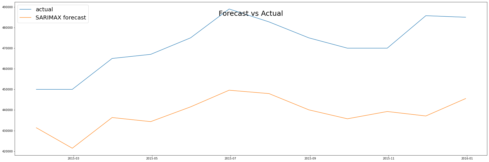
    


```python
rmse(valid['MedianSoldPrice_AllHomes.California'], pred_df['MedianSoldPrice_AllHomes.California'])
# original notebook value: 34,419
```


    34387.8751369937


### In SARIMAX models, the one treating mortage as sole exogenous variable is the best

# VAR
ADFuller stationary tests at the beginning of this notebook show all 3 variables are non-stationary to start. Differencing once makes Median Sold Price and Median Mortgage Rate stationary. Differencing twice makes all three variables stationary.


```python
from statsmodels.tsa.api import VAR
```


```python
hist_df_raw = pd.read_csv('zillow-carlifornia.csv')
hist_df_raw.set_index('Date', inplace=True)
hist_df = hist_df_raw.dropna()  # grab all but last cols with missing MedianSold data
split_date = '2015-01-01'
```


```python
# plot differenced
fig, ax = plt.subplots(1,3, figsize=(15,5))

ax[0].set_title('Undifferenced Target Data')
ax[0].plot(hist_df[hist_df.index < split_date]['MedianSoldPrice_AllHomes.California'], label='Train')
ax[0].plot(hist_df[hist_df.index >= split_date]['MedianSoldPrice_AllHomes.California'], label='Validation')
ax[0].legend(loc='upper left')
ax[0].axis("off")

ax[1].set_title('Once Differenced Target')
d1 = hist_df.diff().dropna()
ax[1].plot(d1[d1.index < split_date]['MedianSoldPrice_AllHomes.California'], label='Train')
ax[1].plot(d1[d1.index >= split_date]['MedianSoldPrice_AllHomes.California'], label='Validation')
ax[1].legend(loc='upper left')
ax[1].axis("off")

ax[2].set_title('Twice Differenced Target')
d2 = d1.diff().dropna()
ax[2].plot(d2[d2.index < split_date]['MedianSoldPrice_AllHomes.California'], label='Train')
ax[2].plot(d2[d2.index >= split_date]['MedianSoldPrice_AllHomes.California'], label='Validation')
ax[2].legend(loc='upper left')
ax[2].axis("off")

plt.show()
# plt.savefig('Basic_plots.png')
```


    
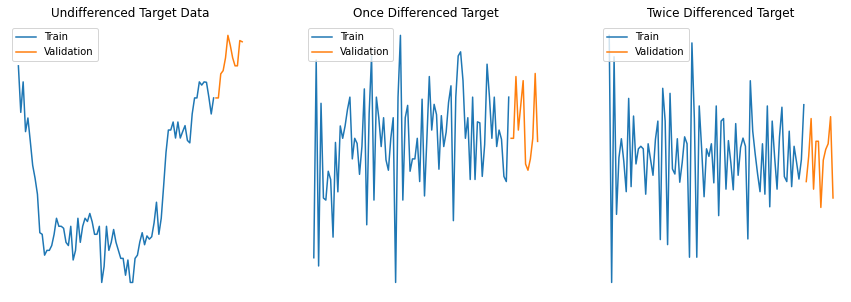
    


## Order Selection
Use BIC to select best VAR(order)

### Once Differenced, Fit All Three (even though unemployment isn't stationary)


```python
d1 = hist_df.diff().dropna()
model1 = VAR(d1)
```


```python
results1 = model1.fit(maxlags=12, ic='bic')
results1.summary()
```


      Summary of Regression Results   
    ==================================
    Model:                         VAR
    Method:                        OLS
    Date:           Mon, 08, Mar, 2021
    Time:                     23:44:06
    --------------------------------------------------------------------
    No. of Equations:         3.00000    BIC:                    14.1741
    Nobs:                     94.0000    HQIC:                   14.1257
    Log likelihood:          -1059.51    FPE:                1.31969e+06
    AIC:                      14.0929    Det(Omega_mle):     1.27845e+06
    --------------------------------------------------------------------
    Results for equation MedianSoldPrice_AllHomes.California
    ========================================================================
               coefficient       std. error           t-stat            prob
    ------------------------------------------------------------------------
    const       159.574468      1194.380592            0.134           0.894
    ========================================================================
    
    Results for equation MedianMortageRate
    ========================================================================
               coefficient       std. error           t-stat            prob
    ------------------------------------------------------------------------
    const        -0.014894         0.018884           -0.789           0.430
    ========================================================================
    
    Results for equation UnemploymentRate
    ========================================================================
               coefficient       std. error           t-stat            prob
    ------------------------------------------------------------------------
    const        -0.012766         0.055928           -0.228           0.819
    ========================================================================
    
    Correlation matrix of residuals
                                           MedianSoldPrice_AllHomes.California  MedianMortageRate  UnemploymentRate
    MedianSoldPrice_AllHomes.California                               1.000000          -0.088980          0.156032
    MedianMortageRate                                                -0.088980           1.000000         -0.038220
    UnemploymentRate                                                  0.156032          -0.038220          1.000000
    
    


```python
print(f'best order: {results1.k_ar}')
```

    best order: 0
    

### Once Differenced, Fit All Both Stationary Vars


```python
d1 = hist_df.diff().dropna()
model2 = VAR(d1[['MedianSoldPrice_AllHomes.California', 'MedianMortageRate']])
```


```python
results2 = model2.fit(maxlags=12, ic='bic')
results2.summary()
```


      Summary of Regression Results   
    ==================================
    Model:                         VAR
    Method:                        OLS
    Date:           Mon, 08, Mar, 2021
    Time:                     23:44:27
    --------------------------------------------------------------------
    No. of Equations:         2.00000    BIC:                    15.3858
    Nobs:                     94.0000    HQIC:                   15.3535
    Log likelihood:          -985.348    FPE:                4.55465e+06
    AIC:                      15.3317    Det(Omega_mle):     4.45927e+06
    --------------------------------------------------------------------
    Results for equation MedianSoldPrice_AllHomes.California
    ========================================================================
               coefficient       std. error           t-stat            prob
    ------------------------------------------------------------------------
    const       159.574468      1194.380592            0.134           0.894
    ========================================================================
    
    Results for equation MedianMortageRate
    ========================================================================
               coefficient       std. error           t-stat            prob
    ------------------------------------------------------------------------
    const        -0.014894         0.018884           -0.789           0.430
    ========================================================================
    
    Correlation matrix of residuals
                                           MedianSoldPrice_AllHomes.California  MedianMortageRate
    MedianSoldPrice_AllHomes.California                               1.000000          -0.088980
    MedianMortageRate                                                -0.088980           1.000000
    
    


```python
print(f'best order: {results2.k_ar}')
```

    best order: 0
    

### Twice Differenced, Fit All Three Vars


```python
d2 = (hist_df.diff().dropna()).diff().dropna()
```


```python
model3 = VAR(d2)
```


```python
results3 = model3.fit(maxlags=12, ic='bic')
results3.summary()
```


      Summary of Regression Results   
    ==================================
    Model:                         VAR
    Method:                        OLS
    Date:           Mon, 08, Mar, 2021
    Time:                     23:45:06
    --------------------------------------------------------------------
    No. of Equations:         3.00000    BIC:                    15.3830
    Nobs:                     91.0000    HQIC:                   15.0373
    Log likelihood:          -1039.93    FPE:                2.68847e+06
    AIC:                      14.8036    Det(Omega_mle):     2.15254e+06
    --------------------------------------------------------------------
    Results for equation MedianSoldPrice_AllHomes.California
    =========================================================================================================
                                                coefficient       std. error           t-stat            prob
    ---------------------------------------------------------------------------------------------------------
    const                                        425.934152      1171.536494            0.364           0.716
    L1.MedianSoldPrice_AllHomes.California        -0.795441         0.093036           -8.550           0.000
    L1.MedianMortageRate                       -6141.513476      5256.332904           -1.168           0.243
    L1.UnemploymentRate                         1294.142627      1712.593525            0.756           0.450
    L2.MedianSoldPrice_AllHomes.California        -0.444624         0.091023           -4.885           0.000
    L2.MedianMortageRate                       -6840.870851      5250.922606           -1.303           0.193
    L2.UnemploymentRate                        -2905.320297      1715.143233           -1.694           0.090
    =========================================================================================================
    
    Results for equation MedianMortageRate
    =========================================================================================================
                                                coefficient       std. error           t-stat            prob
    ---------------------------------------------------------------------------------------------------------
    const                                         -0.000673         0.021968           -0.031           0.976
    L1.MedianSoldPrice_AllHomes.California         0.000002         0.000002            1.254           0.210
    L1.MedianMortageRate                          -0.512808         0.098564           -5.203           0.000
    L1.UnemploymentRate                           -0.019296         0.032114           -0.601           0.548
    L2.MedianSoldPrice_AllHomes.California         0.000003         0.000002            1.644           0.100
    L2.MedianMortageRate                          -0.395424         0.098462           -4.016           0.000
    L2.UnemploymentRate                           -0.056607         0.032161           -1.760           0.078
    =========================================================================================================
    
    Results for equation UnemploymentRate
    =========================================================================================================
                                                coefficient       std. error           t-stat            prob
    ---------------------------------------------------------------------------------------------------------
    const                                          0.002148         0.067065            0.032           0.974
    L1.MedianSoldPrice_AllHomes.California        -0.000009         0.000005           -1.700           0.089
    L1.MedianMortageRate                           0.215699         0.300901            0.717           0.473
    L1.UnemploymentRate                           -0.632483         0.098038           -6.451           0.000
    L2.MedianSoldPrice_AllHomes.California        -0.000000         0.000005           -0.028           0.978
    L2.MedianMortageRate                           0.580773         0.300591            1.932           0.053
    L2.UnemploymentRate                           -0.404776         0.098184           -4.123           0.000
    =========================================================================================================
    
    Correlation matrix of residuals
                                           MedianSoldPrice_AllHomes.California  MedianMortageRate  UnemploymentRate
    MedianSoldPrice_AllHomes.California                               1.000000          -0.182947          0.075872
    MedianMortageRate                                                -0.182947           1.000000          0.006433
    UnemploymentRate                                                  0.075872           0.006433          1.000000
    
    


```python
print(f'best order: {results3.k_ar}')
```

    best order: 2
    


```python
results3.plot_forecast(steps=12)
plt.legend(loc='upper left')
plt.plot();
```


    
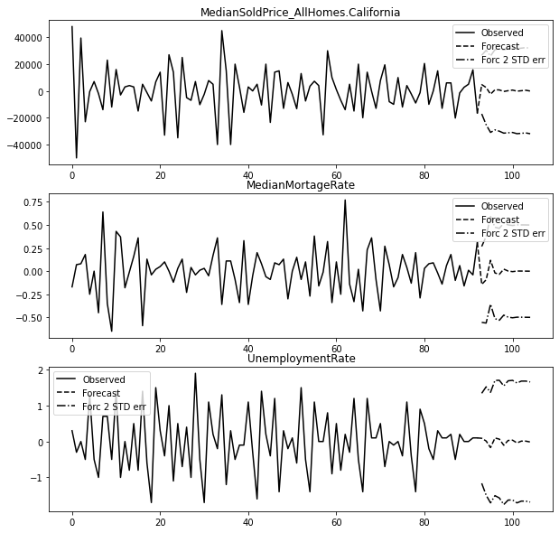
    


### VAR Cross Validation
Now that we've got our best non-zero order for differenced twice data, perform cross-validation to get an RMSE to be able to compare to other models from other families


```python
# inverting transformation
def invert_transformation(dt_train, dt_forecast, second_diff=False):
    """
    Revert back the differencing to get the forecast to original scale.
    This function expects dt_train to be the original undifferenced data ending right before forecasting starts
    """
    dt_fc = dt_forecast.copy()
    columns = dt_train.columns
    for col in columns:        
        # Roll back 2nd Diff
        if second_diff:
            dt_fc[str(col)+'_1d'] = (dt_train[col].iloc[-1]-dt_train[col].iloc[-2]) + dt_fc[str(col)+'_2d'].cumsum()
        # Roll back 1st Diff
        # print('debug: ', dt_train.iloc[-1].name, dt_train.iloc[-2].name, dt_fc.iloc[0].name)
        dt_fc[str(col)+'_0d'] = dt_train[col].iloc[-1] + dt_fc[str(col)+'_1d'].cumsum()
    return dt_fc
```


```python
# Find best model by cross-validation
def rmse_VAR(hist_df, column, lag_order=1, d_order=0):   
    val_idx = hist_df[hist_df.index >= split_date].index
    if d_order > 0:
        hist = hist_df.diff(d_order).dropna()
    else: 
        hist = hist_df.copy()

    cols = hist_df.columns
    predictions = pd.DataFrame(columns=cols + '_0d')
    
    for i, idx in enumerate(val_idx):        
        model = VAR(hist[hist.index < idx])
        res = model.fit(lag_order)
        preds = pd.DataFrame(res.forecast(res.y, steps=1), columns=cols+f'_{d_order}d', index=[idx])
        
        if d_order == 1: preds = invert_transformation(hist_df[hist_df.index < idx], preds)
        if d_order == 2: preds = invert_transformation(hist_df[hist_df.index < idx], preds, True)

        predictions = predictions.append(preds)  # store normalized prediction
        
    return rmse(hist_df[hist_df.index >= split_date][column].values, 
                predictions[column+'_0d'].values)
```


```python
score = rmse_VAR(hist_df, 'MedianSoldPrice_AllHomes.California', lag_order=2, d_order=2)
score
```


    15097.359295448572


```python

```

# Prophet - univariate


```python
import numpy as np 
import pandas as pd 
import warnings
import itertools
import numpy as np
import random
import statsmodels.api as sm
from fbprophet import Prophet
from statsmodels.tsa.seasonal import seasonal_decompose
from statsmodels.graphics.tsaplots import plot_acf, plot_pacf
from sklearn.metrics import mean_squared_error, mean_absolute_error
import matplotlib.pyplot as plt
import seaborn as sns
from statsmodels.tsa.stattools import adfuller
from math import sqrt
from statsmodels.tools.eval_measures import rmse
warnings.filterwarnings("ignore")
```


```python
df = pd.read_csv('zillow-carlifornia.csv', parse_dates=['Date'])
df.columns = ['ds', 'y', 'mortage', 'unemploy']
train = df[df.ds < '2015-01-31']
valid = df[(df.ds >= '2015-01-31') & (df.ds < '2016-01-31')]
```


```python
train1 = train[['ds','y']]
valid1 = valid[['ds','y']]
m1 = Prophet()
m1.fit(train1)
future = m1.make_future_dataframe(periods=len(valid1))
forecast = m1.predict(future)
m1.plot(forecast)
plt.show()
```

    INFO:fbprophet:Disabling weekly seasonality. Run prophet with weekly_seasonality=True to override this.
    INFO:fbprophet:Disabling daily seasonality. Run prophet with daily_seasonality=True to override this.
    


    
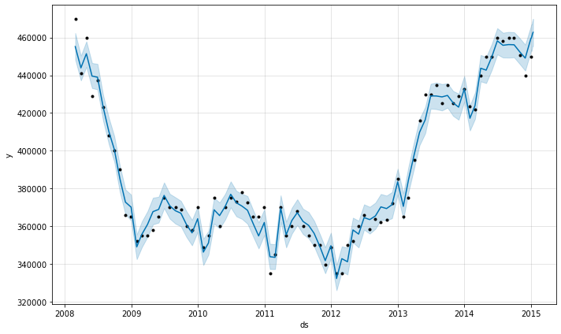
    


```python
m1.plot_components(forecast)
plt.show()
```


    
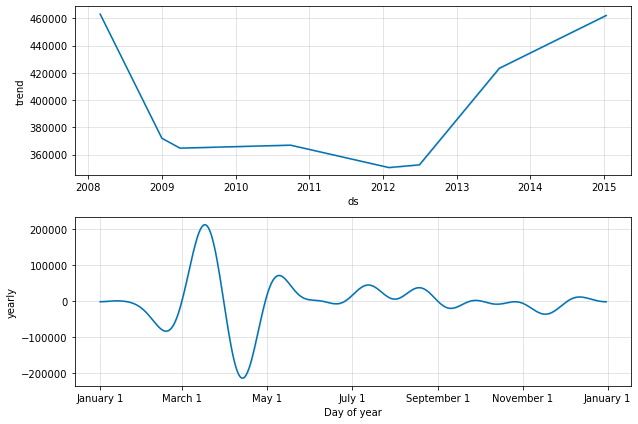
    


```python
pred1 = forecast['yhat'][-len(valid1):]
plt.plot(train1.y,label='history')
plt.plot(valid1.y, label='validation')
plt.plot(pred1, label='prediction')
plt.legend()
plt.show()
```


    
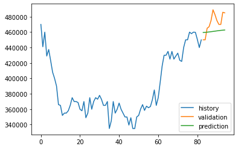
    


```python
# RMSE
se = np.square(pred1 - valid.y)
rmse = np.sqrt(np.mean(se))
print(rmse)
```

    15961.234605210235
    

## Prophet (add Mortgage)


```python
m2=Prophet()
m2.add_regressor('mortage')
m2.fit(train)
```

    INFO:fbprophet:Disabling weekly seasonality. Run prophet with weekly_seasonality=True to override this.
    INFO:fbprophet:Disabling daily seasonality. Run prophet with daily_seasonality=True to override this.
    


    <fbprophet.forecaster.Prophet at 0x126eccf90>


```python
valid2 = valid[['ds','mortage']]
forecast_2 = m2.predict(valid2)
m2.plot(forecast_2)
plt.show()
```


    
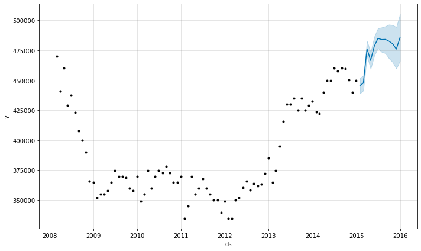
    


```python
m2.plot_components(forecast_2)
plt.show()
```


    
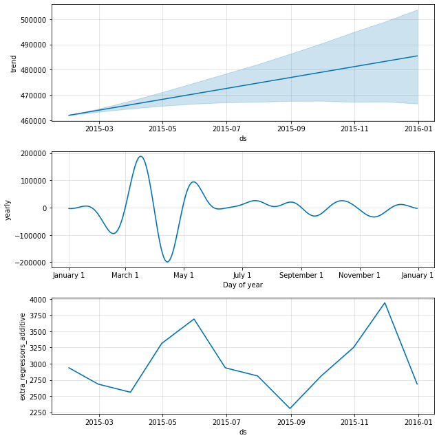
    


```python
pred_2 = pd.Series(forecast_2['yhat'].values,index=valid.index)
plt.plot(train.y,label='history')
plt.plot(valid.y, label='valid')
plt.plot(pred_2, label='prediction')
plt.legend()
plt.title("Add Mortgage")
plt.show()
```


    
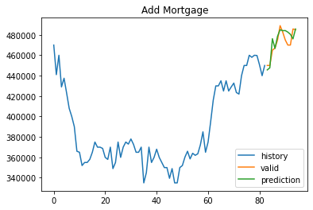
    


```python
n = len(pred_2)
fig, ax = plt.subplots(figsize=(8,4))
ax.plot(train.ds,train.y,label='history',color='#9ba0b3')
ax.plot(valid.ds[-n:],valid.y, label='Validation', color='#0655bd')
ax.plot(valid.ds[-n:],pred_2, label='Prediction',color='#d92e2e')

ax.set_title("Prophet Model with Additive Regressor MedianMortageRate On Validation Set")
ax.spines['left'].set_position(('outward', 10))
ax.spines['bottom'].set_position(('outward', 10))
ax.spines['right'].set_visible(False)
ax.spines['top'].set_visible(False)

ax.legend(loc='upper left')
plt.savefig('Prophet_fit_validation.png')
plt.show()
```


    
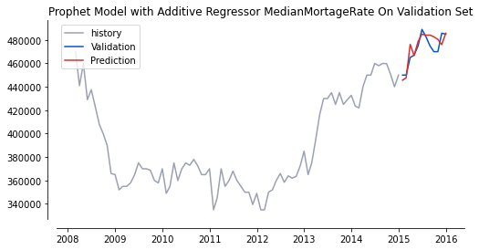
    


```python
se = np.square(pred_2 - valid.y)
rmse = np.sqrt(np.mean(se))
print(rmse)
```

    7257.674601117479
    

## Prophet (add Unemploy)


```python
m3=Prophet()
m3.add_regressor('unemploy')
m3.fit(train)
```

    INFO:fbprophet:Disabling weekly seasonality. Run prophet with weekly_seasonality=True to override this.
    INFO:fbprophet:Disabling daily seasonality. Run prophet with daily_seasonality=True to override this.
    


    <fbprophet.forecaster.Prophet at 0x12ba3e4d0>


```python
valid3 = valid[['ds','unemploy']]
forecast_3 = m3.predict(valid3)
m3.plot(forecast_3)
plt.show()
```


    
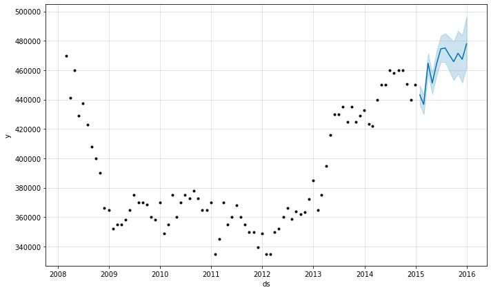
    


```python
pred_3 = pd.Series(forecast_3['yhat'].values,index=valid.index)
plt.plot(train.y,label='history')
plt.plot(valid.y, label='valid')
plt.plot(pred_3, label='prediction')
plt.legend()
plt.title("Add Unemploy")
plt.show()
```


    
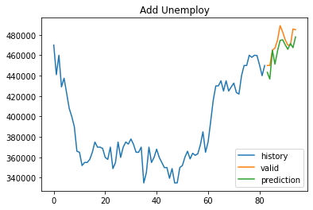
    


```python
se = np.square(pred_3 - valid.y)
rmse = np.sqrt(np.mean(se))
print(rmse)
```

    10315.55645817108
    

## Prophet (add1, add2)


```python
m4=Prophet()
m4.add_regressor('mortage')
m4.add_regressor('unemploy')

m4.fit(train)
```

    INFO:fbprophet:Disabling weekly seasonality. Run prophet with weekly_seasonality=True to override this.
    INFO:fbprophet:Disabling daily seasonality. Run prophet with daily_seasonality=True to override this.
    


    <fbprophet.forecaster.Prophet at 0x12ba31490>


```python
valid4 = valid[['ds','mortage','unemploy']]
forecast_4 = m4.predict(valid4)
m3.plot(forecast_4)
plt.show()
```


    
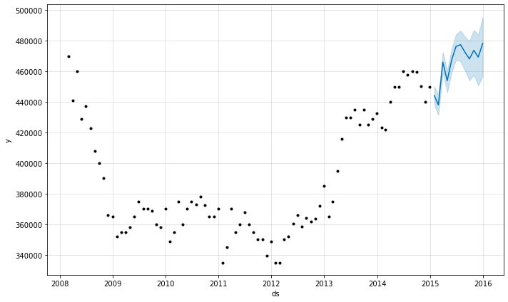
    


```python
pred_4 = pd.Series(forecast_4['yhat'].values,index=valid.index)
plt.plot(train.y,label='history')
plt.plot(valid.y, label='valid')
plt.plot(pred_4, label='prediction')
plt.legend()
plt.show()
```


    
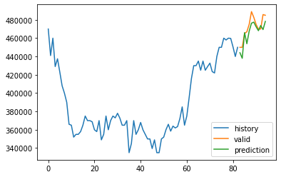
    


```python
se = np.square(pred_4 - valid.y)
rmse = np.sqrt(np.mean(se))
print(rmse)
```

    8804.67301452427
    

# LSTM


```python
zillow = pd.read_csv('zillow-carlifornia.csv', index_col='Date', parse_dates=True, squeeze=True)

testset = zillow[zillow['MedianSoldPrice_AllHomes.California'].isnull()]

trainset = zillow[~zillow['MedianSoldPrice_AllHomes.California'].isnull()]
# no missing values in trainset
```


```python
#Step 1: framing the dataset as a supervised learning problem and normalizing the input variables.
##### a. input: tempurature and beer consumption in previous day
####     output: beer consumption on current day

from sklearn.preprocessing import LabelEncoder
from sklearn.preprocessing import MinMaxScaler

# convert series to supervised learning
def series_to_supervised(data, n_in=1, n_out=1, dropnan=True):
    n_vars = 1 if type(data) is list else data.shape[1]
    df = pd.DataFrame(data)
    cols, names = list(), list()
    # input sequence (t-n, ... t-1)
    for i in range(n_in, 0, -1):
        cols.append(df.shift(i))
        names += [('var%d(t-%d)' % (j+1, i)) for j in range(n_vars)]
    # forecast sequence (t, t+1, ... t+n)
    for i in range(0, n_out):
        cols.append(df.shift(-i))
        if i == 0:
            names += [('var%d(t)' % (j+1)) for j in range(n_vars)]
        else:
            names += [('var%d(t+%d)' % (j+1, i)) for j in range(n_vars)]
    # put it all together
    agg = pd.concat(cols, axis=1)
    agg.columns = names
    # drop rows with NaN values
    if dropnan:
        agg.dropna(inplace=True)
        return agg
```


```python
values = trainset.values
# normalize features
scaler = MinMaxScaler(feature_range=(0, 1))
scaled = scaler.fit_transform(values)
```


```python
reframed = series_to_supervised(scaled, 1, 1) 
print(reframed.head())
```

       var1(t-1)  var2(t-1)  var3(t-1)   var1(t)   var2(t)   var3(t)
    1   0.876623   0.729927   0.317073  0.688312  0.784672  0.292683
    2   0.688312   0.784672   0.292683  0.811688  0.777372  0.341463
    3   0.811688   0.777372   0.341463  0.610390  0.795620  0.317073
    4   0.610390   0.795620   0.317073  0.665584  0.843066  0.292683
    5   0.665584   0.843066   0.292683  0.571429  0.956204  0.146341
    


```python
# drop column we don't want to predict, aka weather
reframed.drop(reframed.columns[[-1,-2]], axis=1, inplace=True)
print(reframed.head())
```

       var1(t-1)  var2(t-1)  var3(t-1)   var1(t)
    1   0.876623   0.729927   0.317073  0.688312
    2   0.688312   0.784672   0.292683  0.811688
    3   0.811688   0.777372   0.341463  0.610390
    4   0.610390   0.795620   0.317073  0.665584
    5   0.665584   0.843066   0.292683  0.571429
    


```python
# split into train and test sets
values = reframed.values
period=int(len(values)*0.8)
train = values[:period, :]
test = values[period:, :]
# split into input and outputs
train_X, train_y = train[:, :-1], train[:, -1]
test_X, test_y = test[:, :-1], test[:, -1]
# reshape input to be 3D [samples, timesteps, features]
train_X = train_X.reshape((train_X.shape[0], 1, train_X.shape[1]))
test_X = test_X.reshape((test_X.shape[0], 1, test_X.shape[1]))
print(train_X.shape, train_y.shape, test_X.shape, test_y.shape)
```

    (75, 1, 3) (75,) (19, 1, 3) (19,)
    


```python
import keras
from keras.models import Sequential
from keras.layers import LSTM
from keras.layers import Dense
from sklearn.metrics import mean_squared_error as mse

# design network
model = Sequential()
model.add(LSTM(50, input_shape=(train_X.shape[1], train_X.shape[2]))) # the 4 is the number of hidden layers/neurons, proportional to the sample size
model.add(Dense(1)) #final fully-connected (dense) layer, optional
model.compile(optimizer='adam', loss='mse')

```

    Using TensorFlow backend.
    


```python
# fit network
history = model.fit(train_X, train_y, epochs=100, batch_size=7, validation_data=(test_X, test_y))
#The model will be fit for 100 training epochs with a batch size of 7. 
#Remember that the internal state of the LSTM in Keras is reset at the end of each batch, so an internal state that is a function of a number of days may be helpful.
```

    WARNING:tensorflow:From /Users/krisjohnson/anaconda3/lib/python3.7/site-packages/keras/backend/tensorflow_backend.py:422: The name tf.global_variables is deprecated. Please use tf.compat.v1.global_variables instead.
    
    

    Train on 75 samples, validate on 19 samples
    Epoch 1/100
    75/75 [==============================] - 1s 15ms/step - loss: 0.1229 - val_loss: 0.6326
    Epoch 2/100
    75/75 [==============================] - 0s 357us/step - loss: 0.0890 - val_loss: 0.5327
    Epoch 3/100
    75/75 [==============================] - 0s 541us/step - loss: 0.0652 - val_loss: 0.4457
    Epoch 4/100
    75/75 [==============================] - 0s 467us/step - loss: 0.0492 - val_loss: 0.3780
    Epoch 5/100
    75/75 [==============================] - 0s 560us/step - loss: 0.0412 - val_loss: 0.3262
    Epoch 6/100
    75/75 [==============================] - 0s 552us/step - loss: 0.0370 - val_loss: 0.2921
    Epoch 7/100
    75/75 [==============================] - 0s 381us/step - loss: 0.0355 - val_loss: 0.2617
    Epoch 8/100
    75/75 [==============================] - 0s 522us/step - loss: 0.0337 - val_loss: 0.2486
    Epoch 9/100
    75/75 [==============================] - 0s 486us/step - loss: 0.0320 - val_loss: 0.2364
    Epoch 10/100
    75/75 [==============================] - 0s 580us/step - loss: 0.0305 - val_loss: 0.2266
    Epoch 11/100
    75/75 [==============================] - 0s 448us/step - loss: 0.0288 - val_loss: 0.2146
    Epoch 12/100
    75/75 [==============================] - 0s 439us/step - loss: 0.0274 - val_loss: 0.1997
    Epoch 13/100
    75/75 [==============================] - 0s 475us/step - loss: 0.0259 - val_loss: 0.1885
    Epoch 14/100
    75/75 [==============================] - 0s 401us/step - loss: 0.0243 - val_loss: 0.1662
    Epoch 15/100
    75/75 [==============================] - 0s 443us/step - loss: 0.0228 - val_loss: 0.1509
    Epoch 16/100
    75/75 [==============================] - 0s 427us/step - loss: 0.0215 - val_loss: 0.1432
    Epoch 17/100
    75/75 [==============================] - 0s 514us/step - loss: 0.0202 - val_loss: 0.1253
    Epoch 18/100
    75/75 [==============================] - 0s 477us/step - loss: 0.0188 - val_loss: 0.1154
    Epoch 19/100
    75/75 [==============================] - 0s 498us/step - loss: 0.0174 - val_loss: 0.1094
    Epoch 20/100
    75/75 [==============================] - 0s 520us/step - loss: 0.0163 - val_loss: 0.0962
    Epoch 21/100
    75/75 [==============================] - 0s 492us/step - loss: 0.0152 - val_loss: 0.0853
    Epoch 22/100
    75/75 [==============================] - 0s 501us/step - loss: 0.0140 - val_loss: 0.0753
    Epoch 23/100
    75/75 [==============================] - 0s 497us/step - loss: 0.0131 - val_loss: 0.0670
    Epoch 24/100
    75/75 [==============================] - 0s 484us/step - loss: 0.0122 - val_loss: 0.0576
    Epoch 25/100
    75/75 [==============================] - 0s 495us/step - loss: 0.0114 - val_loss: 0.0521
    Epoch 26/100
    75/75 [==============================] - 0s 447us/step - loss: 0.0105 - val_loss: 0.0432
    Epoch 27/100
    75/75 [==============================] - 0s 516us/step - loss: 0.0101 - val_loss: 0.0324
    Epoch 28/100
    75/75 [==============================] - 0s 484us/step - loss: 0.0092 - val_loss: 0.0323
    Epoch 29/100
    75/75 [==============================] - 0s 555us/step - loss: 0.0088 - val_loss: 0.0293
    Epoch 30/100
    75/75 [==============================] - 0s 538us/step - loss: 0.0082 - val_loss: 0.0228
    Epoch 31/100
    75/75 [==============================] - 0s 553us/step - loss: 0.0078 - val_loss: 0.0194
    Epoch 32/100
    75/75 [==============================] - 0s 530us/step - loss: 0.0075 - val_loss: 0.0172
    Epoch 33/100
    75/75 [==============================] - 0s 510us/step - loss: 0.0072 - val_loss: 0.0152
    Epoch 34/100
    75/75 [==============================] - 0s 532us/step - loss: 0.0069 - val_loss: 0.0120
    Epoch 35/100
    75/75 [==============================] - 0s 501us/step - loss: 0.0067 - val_loss: 0.0109
    Epoch 36/100
    75/75 [==============================] - 0s 509us/step - loss: 0.0065 - val_loss: 0.0104
    Epoch 37/100
    75/75 [==============================] - 0s 516us/step - loss: 0.0064 - val_loss: 0.0096
    Epoch 38/100
    75/75 [==============================] - 0s 566us/step - loss: 0.0063 - val_loss: 0.0084
    Epoch 39/100
    75/75 [==============================] - 0s 592us/step - loss: 0.0062 - val_loss: 0.0076
    Epoch 40/100
    75/75 [==============================] - 0s 519us/step - loss: 0.0061 - val_loss: 0.0069
    Epoch 41/100
    75/75 [==============================] - 0s 583us/step - loss: 0.0061 - val_loss: 0.0067
    Epoch 42/100
    75/75 [==============================] - 0s 551us/step - loss: 0.0060 - val_loss: 0.0052
    Epoch 43/100
    75/75 [==============================] - 0s 565us/step - loss: 0.0060 - val_loss: 0.0059
    Epoch 44/100
    75/75 [==============================] - 0s 538us/step - loss: 0.0060 - val_loss: 0.0059
    Epoch 45/100
    75/75 [==============================] - 0s 505us/step - loss: 0.0059 - val_loss: 0.0049
    Epoch 46/100
    75/75 [==============================] - 0s 615us/step - loss: 0.0058 - val_loss: 0.0051
    Epoch 47/100
    75/75 [==============================] - 0s 514us/step - loss: 0.0058 - val_loss: 0.0055
    Epoch 48/100
    75/75 [==============================] - 0s 538us/step - loss: 0.0058 - val_loss: 0.0055
    Epoch 49/100
    75/75 [==============================] - 0s 590us/step - loss: 0.0057 - val_loss: 0.0046
    Epoch 50/100
    75/75 [==============================] - 0s 532us/step - loss: 0.0058 - val_loss: 0.0051
    Epoch 51/100
    75/75 [==============================] - 0s 500us/step - loss: 0.0058 - val_loss: 0.0051
    Epoch 52/100
    75/75 [==============================] - 0s 543us/step - loss: 0.0057 - val_loss: 0.0051
    Epoch 53/100
    75/75 [==============================] - 0s 488us/step - loss: 0.0057 - val_loss: 0.0050
    Epoch 54/100
    75/75 [==============================] - 0s 481us/step - loss: 0.0057 - val_loss: 0.0049
    Epoch 55/100
    75/75 [==============================] - 0s 500us/step - loss: 0.0059 - val_loss: 0.0059
    Epoch 56/100
    75/75 [==============================] - 0s 542us/step - loss: 0.0057 - val_loss: 0.0047
    Epoch 57/100
    75/75 [==============================] - 0s 512us/step - loss: 0.0057 - val_loss: 0.0045
    Epoch 58/100
    75/75 [==============================] - 0s 518us/step - loss: 0.0056 - val_loss: 0.0054
    Epoch 59/100
    75/75 [==============================] - 0s 571us/step - loss: 0.0057 - val_loss: 0.0049
    Epoch 60/100
    75/75 [==============================] - 0s 538us/step - loss: 0.0057 - val_loss: 0.0053
    Epoch 61/100
    75/75 [==============================] - 0s 505us/step - loss: 0.0056 - val_loss: 0.0053
    Epoch 62/100
    75/75 [==============================] - 0s 527us/step - loss: 0.0058 - val_loss: 0.0049
    Epoch 63/100
    75/75 [==============================] - 0s 459us/step - loss: 0.0056 - val_loss: 0.0057
    Epoch 64/100
    75/75 [==============================] - 0s 450us/step - loss: 0.0057 - val_loss: 0.0060
    Epoch 65/100
    75/75 [==============================] - 0s 509us/step - loss: 0.0058 - val_loss: 0.0046
    Epoch 66/100
    75/75 [==============================] - 0s 551us/step - loss: 0.0056 - val_loss: 0.0055
    Epoch 67/100
    75/75 [==============================] - 0s 580us/step - loss: 0.0058 - val_loss: 0.0069
    Epoch 68/100
    75/75 [==============================] - 0s 554us/step - loss: 0.0059 - val_loss: 0.0046
    Epoch 69/100
    75/75 [==============================] - 0s 543us/step - loss: 0.0056 - val_loss: 0.0056
    Epoch 70/100
    75/75 [==============================] - 0s 584us/step - loss: 0.0056 - val_loss: 0.0059
    Epoch 71/100
    75/75 [==============================] - 0s 522us/step - loss: 0.0056 - val_loss: 0.0051
    Epoch 72/100
    75/75 [==============================] - 0s 516us/step - loss: 0.0056 - val_loss: 0.0049
    Epoch 73/100
    75/75 [==============================] - 0s 532us/step - loss: 0.0056 - val_loss: 0.0054
    Epoch 74/100
    75/75 [==============================] - 0s 533us/step - loss: 0.0056 - val_loss: 0.0053
    Epoch 75/100
    75/75 [==============================] - 0s 528us/step - loss: 0.0058 - val_loss: 0.0058
    Epoch 76/100
    75/75 [==============================] - 0s 558us/step - loss: 0.0056 - val_loss: 0.0049
    Epoch 77/100
    75/75 [==============================] - 0s 539us/step - loss: 0.0056 - val_loss: 0.0053
    Epoch 78/100
    75/75 [==============================] - 0s 521us/step - loss: 0.0055 - val_loss: 0.0057
    Epoch 79/100
    75/75 [==============================] - 0s 552us/step - loss: 0.0059 - val_loss: 0.0062
    Epoch 80/100
    75/75 [==============================] - 0s 578us/step - loss: 0.0056 - val_loss: 0.0050
    Epoch 81/100
    75/75 [==============================] - 0s 538us/step - loss: 0.0056 - val_loss: 0.0058
    Epoch 82/100
    75/75 [==============================] - 0s 554us/step - loss: 0.0056 - val_loss: 0.0056
    Epoch 83/100
    75/75 [==============================] - 0s 540us/step - loss: 0.0055 - val_loss: 0.0050
    Epoch 84/100
    75/75 [==============================] - 0s 516us/step - loss: 0.0055 - val_loss: 0.0052
    Epoch 85/100
    75/75 [==============================] - 0s 520us/step - loss: 0.0056 - val_loss: 0.0059
    Epoch 86/100
    75/75 [==============================] - 0s 537us/step - loss: 0.0055 - val_loss: 0.0054
    Epoch 87/100
    75/75 [==============================] - 0s 551us/step - loss: 0.0055 - val_loss: 0.0052
    Epoch 88/100
    75/75 [==============================] - 0s 551us/step - loss: 0.0056 - val_loss: 0.0056
    Epoch 89/100
    75/75 [==============================] - 0s 523us/step - loss: 0.0055 - val_loss: 0.0055
    Epoch 90/100
    75/75 [==============================] - 0s 704us/step - loss: 0.0056 - val_loss: 0.0061
    Epoch 91/100
    75/75 [==============================] - 0s 566us/step - loss: 0.0055 - val_loss: 0.0055
    Epoch 92/100
    75/75 [==============================] - 0s 558us/step - loss: 0.0055 - val_loss: 0.0058
    Epoch 93/100
    75/75 [==============================] - 0s 534us/step - loss: 0.0055 - val_loss: 0.0057
    Epoch 94/100
    75/75 [==============================] - 0s 523us/step - loss: 0.0056 - val_loss: 0.0053
    Epoch 95/100
    75/75 [==============================] - 0s 495us/step - loss: 0.0055 - val_loss: 0.0062
    Epoch 96/100
    75/75 [==============================] - 0s 520us/step - loss: 0.0055 - val_loss: 0.0056
    Epoch 97/100
    75/75 [==============================] - 0s 535us/step - loss: 0.0056 - val_loss: 0.0055
    Epoch 98/100
    75/75 [==============================] - 0s 582us/step - loss: 0.0055 - val_loss: 0.0060
    Epoch 99/100
    75/75 [==============================] - 0s 573us/step - loss: 0.0056 - val_loss: 0.0063
    Epoch 100/100
    75/75 [==============================] - 0s 523us/step - loss: 0.0055 - val_loss: 0.0055
    


```python
# make a prediction
yhat = model.predict(test_X)
test_X = test_X.reshape((test_X.shape[0], test_X.shape[2]))

# # invert scaling for forecast
# inv_yhat = np.concatenate((yhat, test_X[:, 1:]), axis=1)
# inv_yhat = scaler.inverse_transform(inv_yhat)
# inv_yhat = inv_yhat[:,0]

# # invert scaling for actual
# test_y = test_y.reshape((len(test_y), 1))
# inv_y = np.concatenate((test_y, test_X[:, 1:]), axis=1)
# inv_y = scaler.inverse_transform(inv_y)
# inv_y = inv_y[:,0]

# invert scaling for forecast
inv_yhat = np.concatenate((yhat, yhat, yhat), axis=1)
inv_yhat = scaler.inverse_transform(inv_yhat)
inv_yhat = inv_yhat[:,0]

# invert scaling for actual
test_y = test_y.reshape((len(test_y), 1))
inv_y = np.concatenate((test_y, test_y, test_y), axis=1)
inv_y = scaler.inverse_transform(inv_y)
inv_y = inv_y[:,0]

```


```python
plt.plot(inv_y)
plt.plot(inv_yhat)
```


    [<matplotlib.lines.Line2D at 0x140f94190>]


    
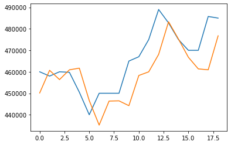
    


```python
np.sqrt(mean_squared_error(inv_y, inv_yhat))
# original notebook: 11,284
```


    11408.704806510645


# Get RMSE on Test Set


```python
test = pd.read_csv('test.csv')
```


```python
test.columns
```


    Index(['Month', 'Median House Price'], dtype='object')


```python
test = test.rename(columns={"Month":"ds","Median House Price":"y"})
```


```python
final_train = df[df.ds < '2016-01-01']
model = Prophet()
model.add_regressor('mortage')
model.fit(final_train)
```

    INFO:fbprophet:Disabling weekly seasonality. Run prophet with weekly_seasonality=True to override this.
    INFO:fbprophet:Disabling daily seasonality. Run prophet with daily_seasonality=True to override this.
    


    <fbprophet.forecaster.Prophet at 0x12dbd4890>


```python
final_test = df[df.ds >= '2016-01-01'][['ds','mortage']]
final_test
```


<div>
<style scoped>
    .dataframe tbody tr th:only-of-type {
        vertical-align: middle;
    }

    .dataframe tbody tr th {
        vertical-align: top;
    }

    .dataframe thead th {
        text-align: right;
    }
</style>
<table border="1" class="dataframe">
  <thead>
    <tr style="text-align: right;">
      <th></th>
      <th>ds</th>
      <th>mortage</th>
    </tr>
  </thead>
  <tbody>
    <tr>
      <th>95</th>
      <td>2016-01-31</td>
      <td>3.91</td>
    </tr>
    <tr>
      <th>96</th>
      <td>2016-02-29</td>
      <td>3.96</td>
    </tr>
    <tr>
      <th>97</th>
      <td>2016-03-31</td>
      <td>3.60</td>
    </tr>
    <tr>
      <th>98</th>
      <td>2016-04-30</td>
      <td>3.60</td>
    </tr>
    <tr>
      <th>99</th>
      <td>2016-05-31</td>
      <td>3.59</td>
    </tr>
    <tr>
      <th>100</th>
      <td>2016-06-30</td>
      <td>3.59</td>
    </tr>
    <tr>
      <th>101</th>
      <td>2016-07-31</td>
      <td>3.46</td>
    </tr>
    <tr>
      <th>102</th>
      <td>2016-08-31</td>
      <td>3.46</td>
    </tr>
    <tr>
      <th>103</th>
      <td>2016-09-30</td>
      <td>3.42</td>
    </tr>
    <tr>
      <th>104</th>
      <td>2016-10-31</td>
      <td>3.36</td>
    </tr>
    <tr>
      <th>105</th>
      <td>2016-11-30</td>
      <td>3.47</td>
    </tr>
    <tr>
      <th>106</th>
      <td>2016-12-31</td>
      <td>4.07</td>
    </tr>
  </tbody>
</table>
</div>


```python
forecast = model.predict(final_test)
model.plot(forecast)
plt.show()
```


    
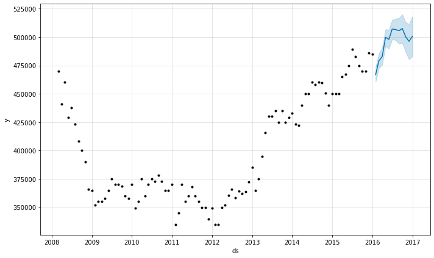
    


```python
pred = pd.Series(forecast['yhat'].values,index=final_test.index)
plt.plot(df.ds,df.y,label='history')
plt.plot(final_test.index,test.y, label='test')
plt.plot(pred, label='prediction')
plt.legend()
plt.show()
```


    
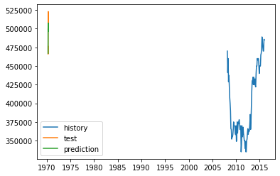
    


```python
n = len(pred)
fig, ax = plt.subplots(figsize=(8,4))
# ax.plot(df.ds[80:-n],final_train.y[80:],label='history',color='#9ba0b3')
ax.plot(df.ds[-n:],test.y, label='Test set', color='#595857')
ax.plot(df.ds[-n:],pred, label='Prediction',color='#d92e2e')

ax.set_title("Prophet Model with Additive Regressor MedianMortageRate On Test Set")
ax.spines['left'].set_position(('outward', 10))
ax.spines['bottom'].set_position(('outward', 10))
ax.spines['right'].set_visible(False)
ax.spines['top'].set_visible(False)

ax.legend(loc='upper left',frameon=False)
# plt.savefig('Prophet_fit.png')
plt.show()
```


    
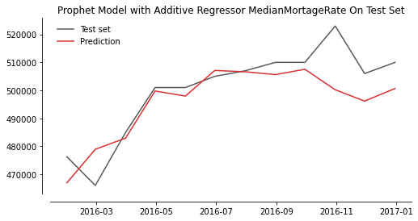
    


```python
se = np.square(pred.values - test.y.values)
rmse = np.sqrt(np.mean(se))
print(rmse)
```

    9140.502251982867
    


```python
pred
```


    95     466943.525569
    96     478929.393656
    97     482929.899181
    98     499769.540418
    99     497958.507751
    100    507107.458225
    101    506638.740844
    102    505629.588579
    103    507538.806872
    104    500198.809576
    105    496157.123337
    106    500659.266337
    dtype: float64


```python
test['Prediction'] = pred.values.round(2)
test = test.rename(columns={"Median House Price":"Real Median House Price"})
```


```python
test
```


<div>
<style scoped>
    .dataframe tbody tr th:only-of-type {
        vertical-align: middle;
    }

    .dataframe tbody tr th {
        vertical-align: top;
    }

    .dataframe thead th {
        text-align: right;
    }
</style>
<table border="1" class="dataframe">
  <thead>
    <tr style="text-align: right;">
      <th></th>
      <th>ds</th>
      <th>y</th>
      <th>Prediction</th>
    </tr>
  </thead>
  <tbody>
    <tr>
      <th>0</th>
      <td>2016-01-31</td>
      <td>476250</td>
      <td>466943.53</td>
    </tr>
    <tr>
      <th>1</th>
      <td>2016-02-29</td>
      <td>466000</td>
      <td>478929.39</td>
    </tr>
    <tr>
      <th>2</th>
      <td>2016-03-31</td>
      <td>485000</td>
      <td>482929.90</td>
    </tr>
    <tr>
      <th>3</th>
      <td>2016-04-30</td>
      <td>501000</td>
      <td>499769.54</td>
    </tr>
    <tr>
      <th>4</th>
      <td>2016-05-31</td>
      <td>501000</td>
      <td>497958.51</td>
    </tr>
    <tr>
      <th>5</th>
      <td>2016-06-30</td>
      <td>505000</td>
      <td>507107.46</td>
    </tr>
    <tr>
      <th>6</th>
      <td>2016-07-31</td>
      <td>507000</td>
      <td>506638.74</td>
    </tr>
    <tr>
      <th>7</th>
      <td>2016-08-31</td>
      <td>510000</td>
      <td>505629.59</td>
    </tr>
    <tr>
      <th>8</th>
      <td>2016-09-30</td>
      <td>510000</td>
      <td>507538.81</td>
    </tr>
    <tr>
      <th>9</th>
      <td>2016-10-31</td>
      <td>523000</td>
      <td>500198.81</td>
    </tr>
    <tr>
      <th>10</th>
      <td>2016-11-30</td>
      <td>506000</td>
      <td>496157.12</td>
    </tr>
    <tr>
      <th>11</th>
      <td>2016-12-31</td>
      <td>510000</td>
      <td>500659.27</td>
    </tr>
  </tbody>
</table>
</div>


```python
with open('pred_test.csv','w') as f:
    f = test
```


```python
rmse
```


    9140.502251982867


__RMSE on test set: 9,140__


```python
test['RMSE Score'] = rmse.round(2)
test['RMSE Score'] = [rmse.round(2)] + [''] * 11
test
```


<div>
<style scoped>
    .dataframe tbody tr th:only-of-type {
        vertical-align: middle;
    }

    .dataframe tbody tr th {
        vertical-align: top;
    }

    .dataframe thead th {
        text-align: right;
    }
</style>
<table border="1" class="dataframe">
  <thead>
    <tr style="text-align: right;">
      <th></th>
      <th>ds</th>
      <th>y</th>
      <th>Prediction</th>
      <th>RMSE Score</th>
    </tr>
  </thead>
  <tbody>
    <tr>
      <th>0</th>
      <td>2016-01-31</td>
      <td>476250</td>
      <td>466943.53</td>
      <td>9140.5</td>
    </tr>
    <tr>
      <th>1</th>
      <td>2016-02-29</td>
      <td>466000</td>
      <td>478929.39</td>
      <td></td>
    </tr>
    <tr>
      <th>2</th>
      <td>2016-03-31</td>
      <td>485000</td>
      <td>482929.90</td>
      <td></td>
    </tr>
    <tr>
      <th>3</th>
      <td>2016-04-30</td>
      <td>501000</td>
      <td>499769.54</td>
      <td></td>
    </tr>
    <tr>
      <th>4</th>
      <td>2016-05-31</td>
      <td>501000</td>
      <td>497958.51</td>
      <td></td>
    </tr>
    <tr>
      <th>5</th>
      <td>2016-06-30</td>
      <td>505000</td>
      <td>507107.46</td>
      <td></td>
    </tr>
    <tr>
      <th>6</th>
      <td>2016-07-31</td>
      <td>507000</td>
      <td>506638.74</td>
      <td></td>
    </tr>
    <tr>
      <th>7</th>
      <td>2016-08-31</td>
      <td>510000</td>
      <td>505629.59</td>
      <td></td>
    </tr>
    <tr>
      <th>8</th>
      <td>2016-09-30</td>
      <td>510000</td>
      <td>507538.81</td>
      <td></td>
    </tr>
    <tr>
      <th>9</th>
      <td>2016-10-31</td>
      <td>523000</td>
      <td>500198.81</td>
      <td></td>
    </tr>
    <tr>
      <th>10</th>
      <td>2016-11-30</td>
      <td>506000</td>
      <td>496157.12</td>
      <td></td>
    </tr>
    <tr>
      <th>11</th>
      <td>2016-12-31</td>
      <td>510000</td>
      <td>500659.27</td>
      <td></td>
    </tr>
  </tbody>
</table>
</div>


```python
test.to_csv('pred_vs_test.csv')
```
