# EDA
---
By using pandas profiling, we can easily visualize all the variables univariately and interactively. The rendered profiling repost is enclosed as `bank_profile_repost.html`. 


```python
import pandas as pd
import numpy as np
import matplotlib.pyplot as plt
import seaborn as sns
```


```python
df = pd.read_csv('bank_comma.csv')
```


```python
df.columns
```


    Index(['age', 'job', 'marital', 'education', 'default', 'housing', 'loan',
           'contact', 'month', 'day_of_week', 'duration', 'campaign', 'pdays',
           'previous', 'poutcome', 'emp.var.rate', 'cons.price.idx',
           'cons.conf.idx', 'euribor3m', 'nr.employed', 'y'],
          dtype='object')


Target Analysis
---

From the target analysis, it’s intuitive that the target variable y is imbalance  where the number negative class rows is more than 8 times of the positive class. 


```python
fig, ax = plt.subplots(figsize=(5,5))
sns.set_theme(style="darkgrid")
ax = sns.countplot(x="y", data=df)
```


    
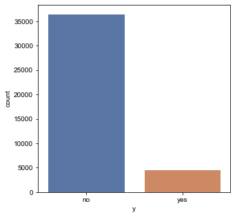
    


Univariate Analysis 
---
From the univariate analysis, majority of the customers are married, have a housing loan, and graduated from university. Among the attributes, column “duration” which shows the duration of the phone call of previous reach out stands out since it’s extremely right skewed as only few people has been contacted and it’s very predictable for the target variable y. Therefore, it should be marked that this variable should only be used for prediction or benchmark purposes. If we really want a model with high generalization, this variable should be excluded. 


```python
# jobs
fig, ax = plt.subplots(figsize=(12,5))
sns.set_theme(style="darkgrid")
ax = sns.countplot(x="job", data=df, hue="y")
```


    
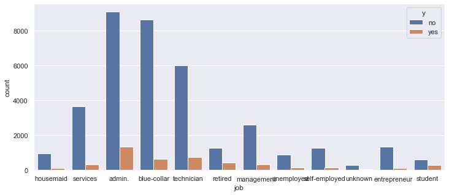
    


```python
# Marital
fig, ax = plt.subplots(figsize=(12,5))
sns.set_theme(style="darkgrid")
ax = sns.countplot(x="marital", data=df, hue="y")
```


    
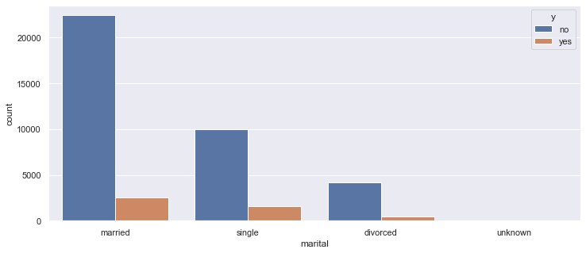
    


```python
# education
fig, ax = plt.subplots(figsize=(12,5))
sns.set_theme(style="darkgrid")
ax = sns.countplot(x="education", data=df, hue="y")
```


    
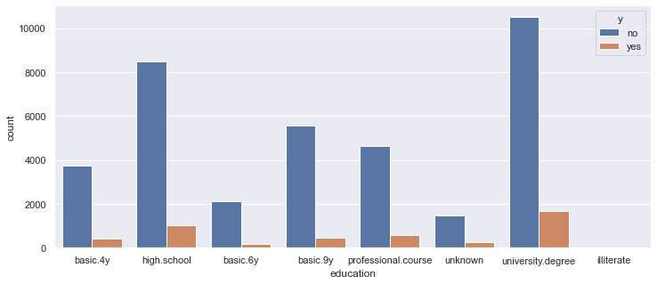
    


```python
# housing
fig, ax = plt.subplots(figsize=(12,5))
sns.set_theme(style="darkgrid")
ax = sns.countplot(x="housing", data=df, hue="y")
```


    
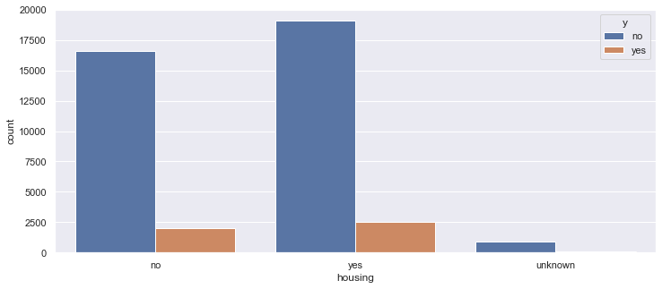
    


```python
# loan
fig, ax = plt.subplots(figsize=(12,5))
sns.set_theme(style="darkgrid")
ax = sns.countplot(x="loan", data=df, hue="y")
```


    
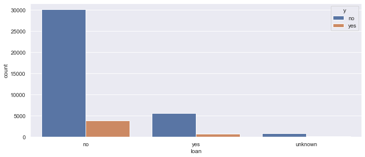
    


```python
# contact
fig, ax = plt.subplots(figsize=(12,5))
sns.set_theme(style="darkgrid")
ax = sns.countplot(x="contact", data=df, hue="y")
```


    
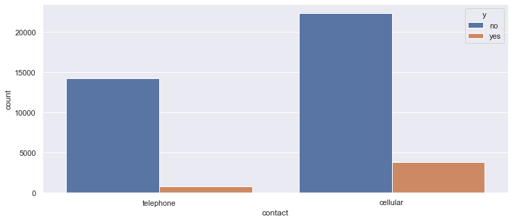
    


```python
# poutcome
fig, ax = plt.subplots(figsize=(12,5))
sns.set_theme(style="darkgrid")
ax = sns.countplot(x="poutcome", data=df, hue="y")
# majority of the preious contact outcome is non-exostence, so this columns might be too predictive for the model. 
```


    
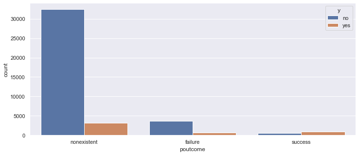
    


```python
# emp.var.rate
fig, ax = plt.subplots(figsize=(12,5))
sns.set_theme(style="darkgrid")
ax = sns.countplot(x="emp.var.rate", data=df, hue="y")
```


    
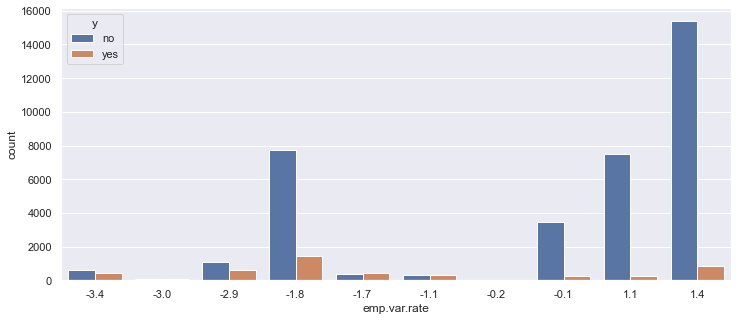
    


```python
# cons.price.idx
fig, ax = plt.subplots(figsize=(12,5))
sns.set_theme(style="darkgrid")
ax = sns.countplot(x="cons.price.idx", data=df, hue="y")
```


    
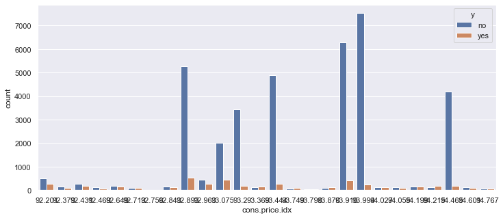
    


```python
# nr.employed
fig, ax = plt.subplots(figsize=(12,5))
sns.set_theme(style="darkgrid")
ax = sns.countplot(x="nr.employed", data=df, hue="y")
```


    
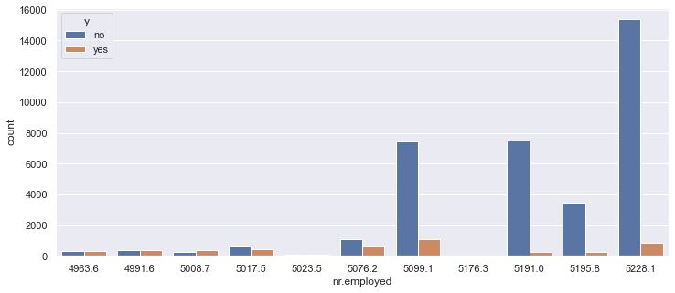
    


Numerical Variable - Correlation plot
---
From the correlation plot of the numerical variables, it’s noticed that employment variation rate, consumer price index, and euribor three months rate are highly correlated to each other, which might result in high dimensionality issue or inaccurate feature importance outcome. 


```python
# Numerical Variable Correlation
fig, ax = plt.subplots(figsize=(9,6))
sns.heatmap(df.corr(), annot=True,ax=ax)
plt.show()
# Number of employees and euribor 3 month rate are highly correlated
```


    

    

